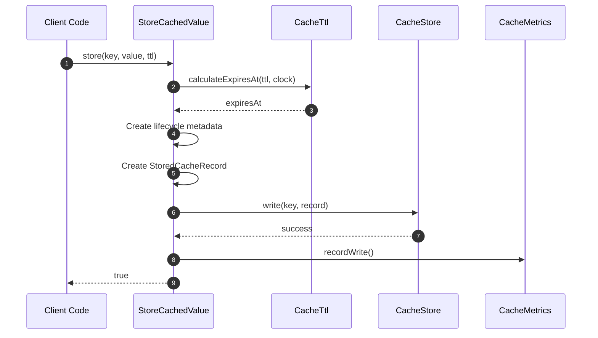

# StoreCachedValue Flow

StoreCachedValue is the flow for **storing values to cache**.

## What This Flow Does

1. Calculate expiration from TTL
2. Create lifecycle metadata
3. Create stored record
4. Write to store
5. Record metrics

## First Important Path



## Direct Files

### StoreCachedValue.php

```php
final readonly class StoreCachedValue
{
    public function __construct(
        private CacheStore $store,
        private Clock $clock,
        private ?CacheMetrics $metrics = null,
        private CacheTtl $ttlCalculator = new CacheTtl()
    ) {}

    public function store(CacheKey $key, mixed $value, null|int|\DateInterval $ttl = null): bool
    {
        try {
            $expiresAt = $this->ttlCalculator->calculateExpiresAt($ttl, $this->clock);
            $defaultExpiry = $expiresAt ?? $this->clock->now()->add(
                Duration::ofSeconds(86400)
            );

            $lifecycle = CachedValueLifecycle::create(
                createdAt: $this->clock->now(),
                expiresAt: $defaultExpiry,
                clock: $this->clock
            );

            $record = new StoredCacheRecord(
                value: $value,
                lifecycle: $lifecycle
            );

            $this->store->write($key, $record);
            $this->metrics?->recordWrite();

            return true;
        } catch (\Throwable $e) {
            $this->metrics?->recordStoreFailure();
            return false;
        }
    }
}
```

## TTL Handling

| TTL Value              | Behavior        |
|------------------------|-----------------|
| `null`                 | 24-hour default |
| `0`                    | Never expires   |
| `3600`                 | 1 hour from now |
| `DateInterval('PT1H')` | 1 hour from now |

## Debug First

1. **Start here** when set() returns false
2. **Check TTL calculation** - wrong TTL = wrong expiration
3. **Check lifecycle** - metadata must be created correctly
4. **Check store write** - store might be failing

## Dictionary

- `StoreCachedValue`: Flow for storing values
- `CachedValueLifecycle`: Metadata for the cached value
- `StoredCacheRecord`: Value + lifecycle packaged together