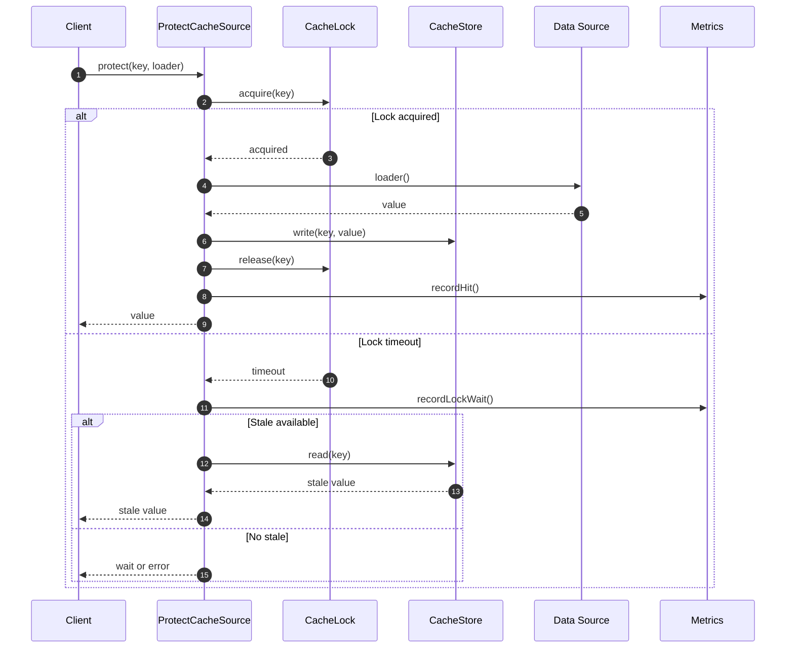

# ProtectCacheSource Flow

ProtectCacheSource implements **stampede protection** to prevent cache stampede (thundering herd) when many requests
miss the cache simultaneously.

## What This Flow Does

1. Check if another process is already loading
2. If locked, wait or serve stale
3. If unlocked, acquire lock and load
4. Release lock and return value

## First Important Path



## Lock Types

### CacheLock

```php
final readonly class CacheLock
{
    public function __construct(
        private CacheLockStore $lockStore,
        private CacheLockTimeout $timeout = new CacheLockTimeout(5)
    ) {}

    public function acquire(string $key, int $ttlSeconds = 30): bool
    {
        return $this->lockStore->acquire($key, $ttlSeconds);
    }

    public function release(string $key): void
    {
        $this->lockStore->release($key);
    }

    public function isAcquired(string $key): bool
    {
        return $this->lockStore->isAcquired($key);
    }
}
```

### CacheLockStore

Interface for lock storage (can use Redis, memcached, etc.)

### CacheLockTimeout

```php
final readonly class CacheLockTimeout
{
    public function __construct(
        public int $seconds = 5
    ) {}

    public function isExpired(int $acquiredAt): bool
    {
        return (time() - $acquiredAt) > $this->seconds;
    }
}
```

## Stampede Scenarios

### Scenario 1: First Request

```
Request A arrives
Lock acquired by A
A loads from source
A stores in cache
Lock released
```

### Scenario 2: Stampede

```
Request A: Lock acquired, loading...
Request B: Lock timeout, serve stale
Request C: Lock timeout, serve stale
Request D: Lock timeout, serve stale
```

### Scenario 3: All Waiting

```
Request A: Lock acquired, loading...
Request B: Waiting for A...
Request C: Waiting for A...
Request A: Done, releases lock, value in cache
Request B: System hit, returns value
Request C: System hit, returns value
```

## Debug First

1. **Check lock store** - is locking working?
2. **Check timeout** - is timeout appropriate?
3. **Check stale policy** - can stale be served?

## Dictionary

- `CacheLock`: Lock acquisition/release
- `CacheLockStore`: Lock storage backend
- `CacheLockTimeout`: Lock timeout configuration
- `CacheLockOwner`: Who holds the lock