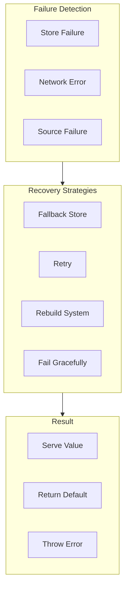

# RecoverCache Flow

RecoverCache handles **failure recovery** for cache operations.

## What This Flow Does

1. Detect store failure
2. Determine recovery strategy
3. Execute recovery
4. Return result or fallback

## Recovery Strategies



## Recovery Classes

### RecoverCacheAfterStoreFailure

```php
final readonly class RecoverCacheAfterStoreFailure
{
    public function __construct(
        private CacheStore $store,
        private ?CacheStore $fallbackStore = null
    ) {}

    public function readWithRecovery(
        CacheKey $key,
        Clock $clock
    ): CacheStoreRecordWasFound|CacheStoreRecordWasMissing {
        try {
            return $this->store->read($key, $clock);
        } catch (\Throwable $e) {
            return $this->tryFallback($key, $clock);
        }
    }

    private function tryFallback(
        CacheKey $key,
        Clock $clock
    ): CacheStoreRecordWasFound|CacheStoreRecordWasMissing {
        if ($this->fallbackStore === null) {
            return new CacheStoreRecordWasMissing($key);
        }

        try {
            return $this->fallbackStore->read($key, $clock);
        } catch (\Throwable $e) {
            return new CacheStoreRecordWasMissing($key);
        }
    }
}
```

### FailOverToNextCacheStore

```php
final readonly class FailOverToNextCacheStore
{
    /** @var CacheStore[] */
    private array $stores;
    private int $currentIndex = 0;

    public function __construct(CacheStore ...$stores)
    {
        $this->stores = $stores;
    }

    public function read(
        CacheKey $key,
        Clock $clock
    ): CacheStoreRecordWasFound|CacheStoreRecordWasMissing {
        $startIndex = $this->currentIndex;

        do {
            try {
                $result = $this->stores[$this->currentIndex]->read($key, $clock);
                $this->currentIndex = ($this->currentIndex + 1) % count($this->stores);

                return $result;
            } catch (\Throwable $e) {
                $this->currentIndex = ($this->currentIndex + 1) % count($this->stores);
            }
        } while ($this->currentIndex !== $startIndex);

        return new CacheStoreRecordWasMissing($key);
    }
}
```

### RebuildCachedValuesFromSource

```php
final readonly class RebuildCachedValuesFromSource
{
    public function __construct(
        private CacheStore $store,
        private callable $sourceLoader
    ) {}

    public function rebuild(
        CacheKey $key,
        null|int|\DateInterval $ttl = null
    ): mixed {
        try {
            $value = ($this->sourceLoader)($key);

            $ttlCalculator = new CacheTtl();
            $expiresAt = $ttlCalculator->calculateExpiresAt($ttl, new SystemClock());

            $lifecycle = CachedValueLifecycle::create(
                createdAt: Timestamp::now(),
                expiresAt: $expiresAt,
                clock: new SystemClock()
            );

            $this->store->write($key, new StoredCacheRecord(
                value: $value,
                lifecycle: $lifecycle
            ));

            return $value;
        } catch (\Throwable $e) {
            return null;
        }
    }
}
```

## Debug First

1. **Check failure type** - what kind of failure?
2. **Check fallback store** - is fallback configured?
3. **Check source loader** - can source be reached?

## Dictionary

- `RecoverCacheAfterStoreFailure`: Recover from store failure
- `FailOverToNextCacheStore`: Round-robin failover
- `RebuildCachedValuesFromSource`: Rebuild cache from source