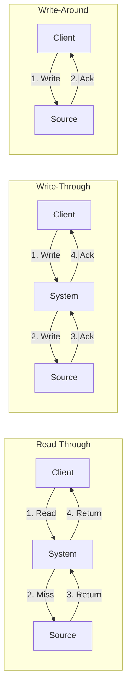

# SyncCachedValue Flow

SyncCachedValue handles **source synchronization** patterns.

## What This Flow Does

1. Read-through cache
2. Write-through cache
3. Write-around cache

## Synchronization Patterns



## Sync Classes

### ReadThroughCache

```php
final readonly class ReadThroughCache
{
    public function __construct(
        private CacheStore $store,
        private Clock $clock,
        private callable $sourceLoader
    ) {}

    public function read(
        CacheKey $key,
        mixed $default = null
    ): mixed {
        $result = $this->store->read($key, $this->clock);

        if ($result instanceof CacheStoreRecordWasFound) {
            return $result->value();
        }

        try {
            $value = ($this->sourceLoader)($key);
            $this->storeValue($key, $value);

            return $value;
        } catch (\Throwable $e) {
            return $default;
        }
    }

    private function storeValue(CacheKey $key, mixed $value): void
    {
        $lifecycle = CachedValueLifecycle::create(
            createdAt: $this->clock->now(),
            expiresAt: $this->clock->now()->add(Duration::ofSeconds(3600)),
            clock: $this->clock
        );

        $this->store->write($key, new StoredCacheRecord(
            value: $value,
            lifecycle: $lifecycle
        ));
    }
}
```

### WriteThroughCache

```php
final readonly class WriteThroughCache
{
    public function __construct(
        private CacheStore $store,
        private Clock $clock,
        private callable $sourceWriter
    ) {}

    public function write(
        CacheKey $key,
        mixed $value,
        null|int|\DateInterval $ttl = null
    ): bool {
        try {
            ($this->sourceWriter)($key, $value);

            $this->store->write($key, $this->createRecord($key, $value, $ttl));

            return true;
        } catch (\Throwable $e) {
            return false;
        }
    }

    private function createRecord(
        CacheKey $key,
        mixed $value,
        null|int|\DateInterval $ttl
    ): StoredCacheRecord {
        $ttlCalculator = new CacheTtl();
        $expiresAt = $ttlCalculator->calculateExpiresAt($ttl, $this->clock);

        return new StoredCacheRecord(
            value: $value,
            lifecycle: CachedValueLifecycle::create(
                createdAt: $this->clock->now(),
                expiresAt: $expiresAt,
                clock: $this->clock
            )
        );
    }
}
```

### WriteAroundCache

```php
final readonly class WriteAroundCache
{
    public function __construct(
        private CacheStore $store,
        private Clock $clock,
        private callable $sourceWriter,
        private callable $sourceDeleter
    ) {}

    public function write(
        CacheKey $key,
        mixed $value
    ): bool {
        try {
            ($this->sourceWriter)($key, $value);
            return true;
        } catch (\Throwable $e) {
            return false;
        }
    }

    public function delete(CacheKey $key): bool
    {
        try {
            ($this->sourceDeleter)($key);
            $this->store->forget($key);
            return true;
        } catch (\Throwable $e) {
            return false;
        }
    }
}
```

## SyncWithSource Classes

```php
interface CacheSource
{
    public function load(CacheSourceKey $key): mixed;
    public function write(CacheSourceKey $key, mixed $value): void;
    public function delete(CacheSourceKey $key): void;
}

interface DeferredSourceWrite
{
    public function queue(CacheSourceKey $key, mixed $value): void;
    public function flush(): void;
}
```

## Debug First

1. **Check source loader/writer** - is source accessible?
2. **Check sync timing** - is write-through slow?
3. **Check consistency** - is cache in sync?

## Dictionary

- `ReadThroughCache`: Load from source on cache miss
- `WriteThroughCache`: Write to source and cache together
- `WriteAroundCache`: Write to source only
- `CacheSource`: Data source interface
- `DeferredSourceWrite`: Write-behind queue