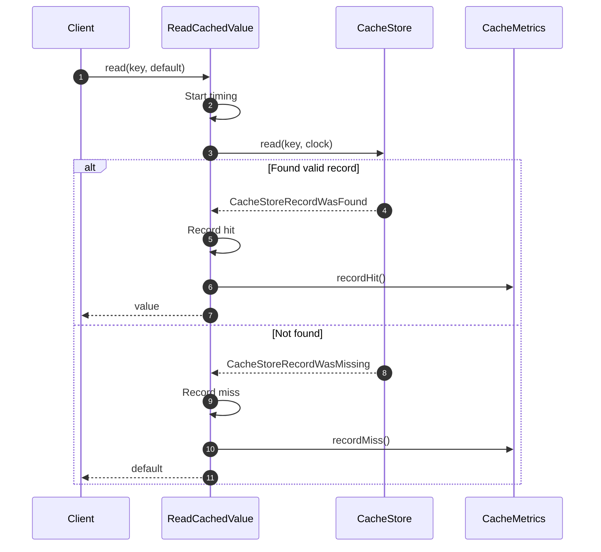

# Flows How This Works

Flows describe **end-to-end system behavior**. They are the primary narrative of the system.

## What This Folder Owns

Flows own meaningful sequences:

- ReadCachedValue: Reading from cache
- StoreCachedValue: Storing to cache
- RememberCachedValue: Get-or-load pattern
- ForgetCachedValue: Deleting entries
- ClearCache: Clearing all entries
- InvalidateCachedValue: Invalidation operations
- RefreshCachedValue: Proactive refresh
- EvictCachedValue: Capacity eviction
- WarmCache: System warming
- ProtectCacheSource: Stampede protection
- SyncCachedValue: Source synchronization
- RecoverCache: Failure recovery

## Flow Properties

Each flow:

- Has one clear purpose
- Owns a meaningful sequence
- Has a descriptive name
- Delegates to capabilities
- Tracks observability

## Flow Structure

```php
final readonly class ReadCachedValue
{
    public function __construct(
        private CacheStore $store,
        private Clock $clock,
        private ?CacheMetrics $metrics = null
    ) {}

    public function read(CacheKey $key, mixed $default = null): mixed
    {
        // 1. Start timing
        // 2. Check store
        // 3. Record metrics
        // 4. Return result
    }
}
```

## First Important Path: ReadCachedValue



## Flow vs Capability

| Flow                     | Capability                 |
|--------------------------|----------------------------|
| What the system **does** | What the system **uses**   |
| End-to-end behavior      | Shared mechanism           |
| User-facing              | Infrastructure             |
| Orchestrates             | Provides atomic operations |

## Locality Rule

A concern belongs to one flow until it becomes truly shared.

Example:

- `ReadCachedValue` flow handles reading
- `CacheStore.read()` handles store-level read
- Both are separate because they serve different owners

## Naming Convention

Flow names are action phrases:

- `ReadCachedValue` - describes reading action
- `StoreCachedValue` - describes storing action
- `RememberCachedValue` - describes remember pattern
- `ForgetCachedValue` - describes forgetting action

## Dictionary

- `Flow`: A meaningful sequence of operations that accomplishes a system task
- `ReadCachedValue`: Flow that retrieves a value from cache
- `RememberCachedValue`: Flow that gets from cache or loads from source and caches
- `EvictCachedValue`: Flow that removes entries due to capacity pressure