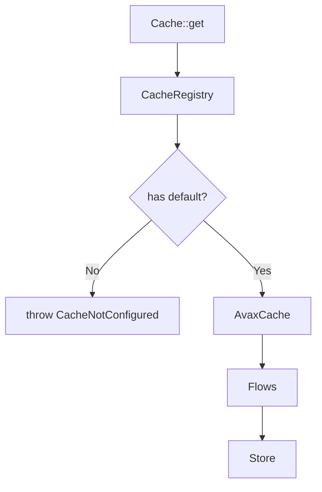

# PublicSurface

The user-facing entrypoint layer. This is what developers see first.

## What This Owns

- Cache - static facade for runtime cache
- CacheFacade - instance facade for DI/testing
- CacheRegistry - named cache instance registry
- CompiledCache - static facade for compiled artifacts

## User Mental Model

```php
// Simple usage
Cache::get('key');
Cache::put('key', $value, ttl: 3600);
Cache::remember('key', 3600, fn () => $loader->load());
Cache::forget('key');

// Named stores
Cache::store('api')->get('key');

// Testing
Cache::use($mockCache);
Cache::reset();
```

## Main Flow



## Components

- **Cache**: static facade, delegates to registry
- **CacheFacade**: instance version for DI
- **CacheRegistry**: holds named cache instances
- **CompiledCache**: separate facade for artifacts