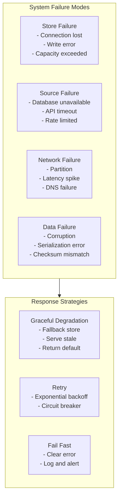
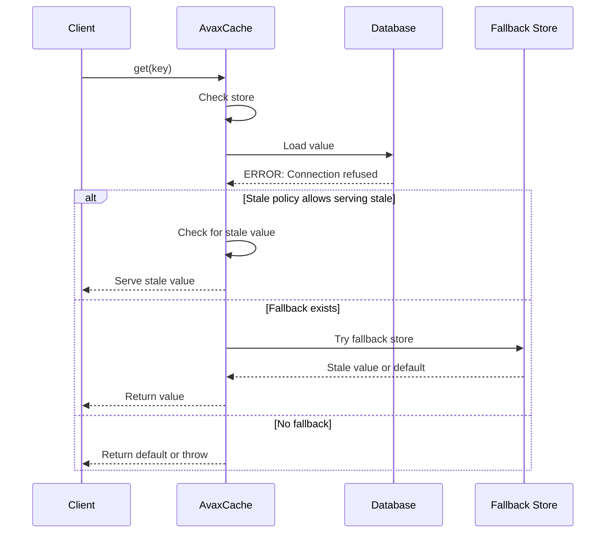
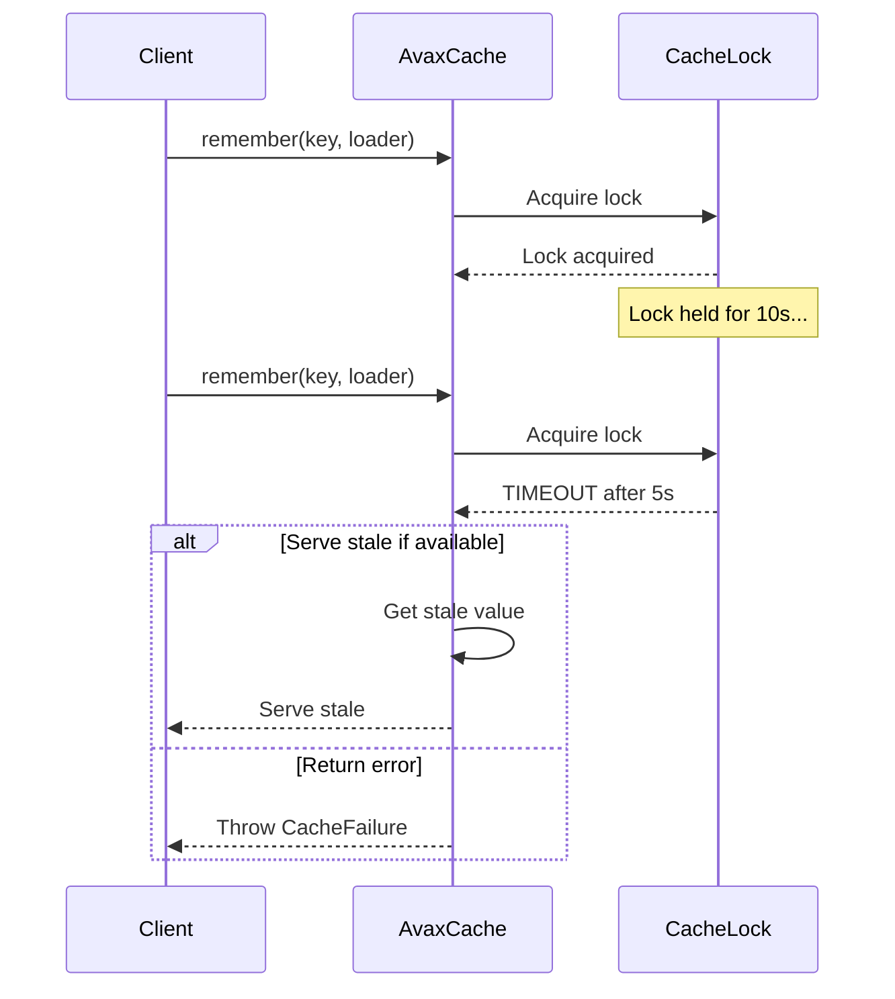

# AvaxCache Failure Modes

## Overview

Understanding failure modes is critical for designing resilient caching systems. This document outlines potential
failures and recommended handling strategies.

## Failure Classification



## Store Failures

### Connection Loss

```php
try {
    $cache->get('key');
} catch (CacheFailure $e) {
    if ($e->code === CacheFailure::CODE_STORE_UNAVAILABLE) {
        // Switch to fallback
        $fallback = new FileCacheStore('/tmp/cache');
        $value = $fallback->get('key');
    }
}
```

### Write Failure

```php
$cache->set('key', $value); // Returns false on failure
// Log error, alert monitoring
```

### Capacity Exceeded

```php
try {
    $cache->set('key', $largeValue);
} catch (CacheFailure $e) {
    if ($e->code === CacheFailure::CODE_CAPACITY_EXCEEDED) {
        // Evict and retry
        EvictCachedValue::evictUntilCapacityIsSafe($entries, $maxCapacity);
        $cache->set('key', $largeValue);
    }
}
```

## Source Failures

### Database Unavailable



### Handling Strategy

```php
$result = $cache->get('key', default: null);

if ($result === null) {
    try {
        $result = $database->find($key);
        $cache->set($key, $result, ttl: 3600);
    } catch (DatabaseException $e) {
        // Log error
        // Alert monitoring
        // Return empty result or throw
    }
}
```

## Serialization Failures

```php
try {
    $cache->set('key', $complexObject);
} catch (CacheFailure $e) {
    if ($e->code === CacheFailure::CODE_SERIALIZATION_FAILED) {
        // Use JSON-safe serialization
        // Or simplify stored data
        $cache->set($key, json_encode($complexObject));
    }
}
```

## Lock Timeout (Stampede Protection Failure)



## Error Codes

| Code | Constant                    | Description                        |
|------|-----------------------------|------------------------------------|
| 1001 | `CODE_STORE_UNAVAILABLE`    | System store is unreachable        |
| 1002 | `CODE_KEY_INVALID`          | System key validation failed       |
| 1003 | `CODE_SERIALIZATION_FAILED` | Value could not be serialized      |
| 1004 | `CODE_CAPACITY_EXCEEDED`    | Maximum cache capacity reached     |
| 1005 | `CODE_NETWORK_ERROR`        | Network-level error                |
| 1006 | `CODE_SOURCE_UNAVAILABLE`   | Data source is unavailable         |
| 1007 | `CODE_LOCK_TIMEOUT`         | Stampede protection lock timed out |
| 1008 | `CODE_VALIDATION_FAILED`    | Value validation failed            |

## Best Practices

1. **Always check return values**: `set()` returns `bool`, not `void`
2. **Use timeouts**: Configure appropriate timeouts for all operations
3. **Monitor metrics**: Track `store_failures`, `source_failures`, `stale_served`
4. **Implement fallback**: Use `FallbackCacheStore` for resilience
5. **Log failures**: Include key, operation, and error details
6. **Test failure paths**: Use `FailingCacheStore` in tests