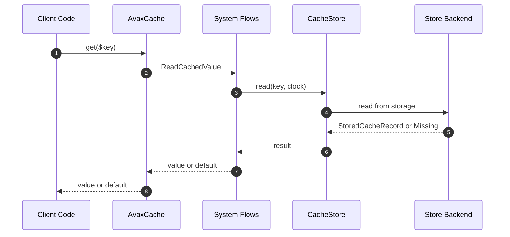

# AvaxCache How This Works

AvaxCache is a **system-design grade caching framework** for PHP 8.5+, implementing a comprehensive value lifecycle
model,
storage abstraction, and consistency guarantees across multiple store backends.

## What This System Is

AvaxCache is a smart cache layer that manages the **complete lifecycle of cached values**: creation, reading, aging,
invalidation, refresh, eviction, distribution, and recovery. It is designed to work with local, file, Redis, multi-tier,
and distributed stores, without inventing its own distributed database.

## Real Commands or Triggers That Reach This System

- `$cache->get($key)` → ReadCachedValue flow
- `$cache->set($key, $value, $ttl)` → StoreCachedValue flow
- `$cache->remember($key, $ttl, $loader)` → RememberCachedValue flow
- `$cache->delete($key)` → ForgetCachedValue flow
- `$cache->clear()` → ClearCache flow

## The Simplest Story

## Direct Files in This System

### System/AvaxCache.php

The main entry point implementing the `System` interface. Orchestrates flows and delegates to stores.

### System/System.php

The public `System` interface defining the stable API contract.

### System/CacheResult.php

A discriminated union result type representing all possible cache operation outcomes (HIT, MISS, EXPIRED, STALE, etc.).

### System/CacheResultState.php

Enum defining all possible cache result states.

### System/CachedValue.php

A simple value object representing a cached value with TTL and creation timestamp.

### System/CacheFailure.php

Exception class for cache-specific failures with error codes.

### System/MissingCachedValue.php

Marker class for missing cache entries.

## Child Folders

### Foundation/

Contains primitive building blocks: Time (Clock, Timestamp, Duration), Serialization (CacheSerializer), Compression,
and Randomness utilities.

### Capabilities/

Shared system abilities including:

- **IdentifyCachedValues**: CacheKey, CacheKeyPrefix, CacheNamespace, CacheTag, CacheTags, CacheVersion
- **ManageCacheLifecycle**: Lifecycle management with expiration, invalidation, replacement, refresh, and stale policies
- **StoreCachedValues**: Store abstractions (CacheStore, InMemoryCacheStore, FileCacheStore, ChainCacheStore)
- **ObserveCache**: Metrics and tracing capabilities
- **ProtectCacheSource**: Stampede protection with locks and request coalescing
- **UseCacheTiers**: Multi-tier cache support
- **DistributeCachedValues**: Distributed cache partitioning
- **SyncWithSource**: Source synchronization

### Flows/

End-to-end operation flows:

- **ReadCachedValue**: Reading from cache
- **StoreCachedValue**: Storing to cache
- **RememberCachedValue**: Get-or-load pattern
- **ForgetCachedValue**: Deleting entries
- **ClearCache**: Clearing all entries
- **InvalidateCachedValue**: Invalidation by key, tag, namespace
- **RefreshCachedValue**: Proactive refresh
- **EvictCachedValue**: Capacity eviction
- **WarmCache**: System warming
- **ProtectCacheSource**: Stampede protection flows
- **SyncCachedValue**: Source synchronization flows
- **RecoverCache**: Failure recovery flows

### Configuration/

Building and configuration utilities:

- **CacheConfiguration**: Configuration options
- **CacheStoreConfiguration**: Store-specific configuration
- **BuildCache**: Factory for creating cache instances

## Debug First

- Start in `AvaxCache.php` when cache returns unexpected value
- Start in `InMemoryCacheStore.php` when testing locally
- Start in `FileCacheStore.php` when debugging file-based cache
- Start in `CacheLifecyclePolicy.php` when investigating expiration issues

## What to Remember

- **System miss !== stored null**. Null is a valid cached value.
- **Expired !== Stale**. Expired means invalid by time. Stale means old but potentially usable.
- **All stores implement CacheStore interface**. New backends must pass contract tests.
- **Clock is injected everywhere**. Time is never called directly from core logic.
- **Metrics are optional**. Observability can be disabled for performance.

## Dictionary

- `CacheKey`: A validated, normalized, namespaced cache key
- `CachedValueLifecycle`: Metadata tracking the complete lifecycle of a cached entry
- `CacheStore`: Abstract storage interface for cache backends
- `CachedValueState`: Enum representing the current state of a cached value (ACTIVE, EXPIRED, STALE, etc.)
- `StaleValuePolicy`: Controls whether stale values can be served while refreshing
- `ReplacementPolicy`: Strategy for choosing which entry to evict when capacity is reached