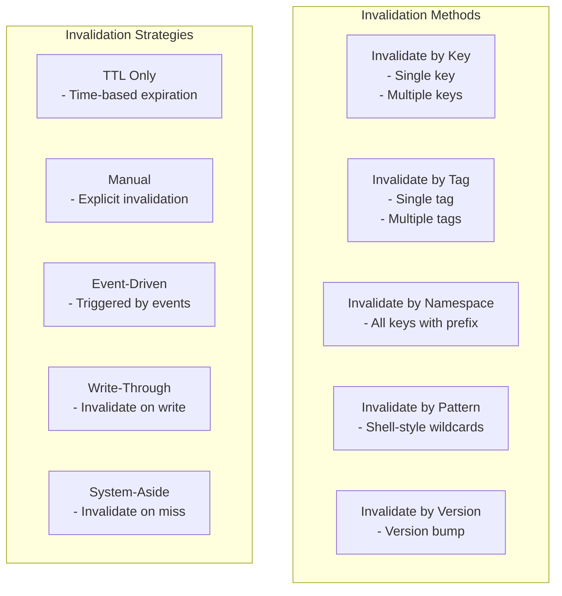

# AvaxCache Invalidation Model

## Overview

System invalidation is one of the hardest problems in computer science. AvaxCache provides multiple strategies
and methods to handle invalidation correctly.

## Invalidation Methods



## Invalidation Methods

### By Key

```php
$cache->delete('user:123');

// Or via flow
$invalidate = new InvalidateCachedValue($store, $clock);
$invalidate->invalidateByKey(CacheKey::create('user:123'));
```

### By Tag

```php
// Assuming tags are tracked
$invalidate->invalidateByTag(CacheTag::create('users'));

// Invalidate all tags
$invalidate->invalidateByTags([
    CacheTag::create('users'),
    CacheTag::create('profiles'),
]);
```

### By Namespace

```php
$namespace = CacheNamespace::create('users');

// All keys starting with 'users:' are invalidated
$invalidate->invalidateByNamespace('users');
```

### By Pattern

```php
// All user keys
$invalidate->invalidateByPattern('user:*');

// All user keys with specific prefix
$invalidate->invalidateByPattern('user:123:*');
```

### By Version

```php
$newVersion = CacheVersion::current()->incrementMajor();
$invalidate->invalidateVersion($newVersion);
```

## Invalidation Strategies

### TTL Only Strategy

```php
// Values expire automatically after TTL
$cache->set('key', $value, ttl: 3600);
```

### Manual Strategy

```php
// Explicit invalidation on data change
$user = $userRepository->update($id, $data);
$cache->delete("user:{$id}");
```

### Event-Driven Strategy

```php
// Listen to domain events
EventBus::subscribe(UserUpdated::class, function(UserUpdated $event) {
    $cache->delete("user:{$event->userId}");
});
```

### Write-Through Strategy

```php
class WriteThroughCache {
    public function update($id, $data) {
        $this->source->update($id, $data);
        $this->cache->delete("entity:{$id}");
    }
}
```

## Soft vs Hard Invalidation

```mermaid
stateDiagram-v2
    [*] --> Active

    state Active {
        [*] --> ActiveValue
        ActiveValue --> SoftInvalidated: Soft invalidate
        ActiveValue --> HardInvalidated: Hard invalidate
    }

    SoftInvalidated --> Serving: Stale policy allows
    Serving --> Refreshed: Reload from source
    Refreshed --> ActiveValue: New value stored
    HardInvalidated --> [*]: Value removed

    note right of SoftInvalidated
        Value marked stale but
        still servable while refreshing
    end
```

### Soft Invalidation

```php
// Mark as stale but continue serving
$invalidate->markStale(CacheKey::create('user:123'));

// Serve stale while refreshing
$policy = new DecideStaleValueCanBeServed(
    policy: StaleValuePolicy::SERVE_STALE_WHILE_REFRESHING
);
```

### Hard Invalidation

```php
// Immediately remove from cache
$cache->delete('user:123');
```

## Invalidation Reasons

```php
enum InvalidationReason: string
{
    case EXPLICIT = 'explicit';
    case TTL_EXPIRED = 'ttl_expired';
    case STALE_POLICY = 'stale_policy';
    case VERSION_CHANGE = 'version_change';
    case TAG_INVALIDATION = 'tag_invalidation';
    case NAMESPACE_CLEAR = 'namespace_clear';
    case PATTERN_MATCH = 'pattern_match';
    case CAPACITY_PRESSURE = 'capacity_pressure';
    case SOURCE_UPDATED = 'source_updated';
    case MAINTENANCE = 'maintenance';
}
```

## Best Practices

1. **Prefer TTL for time-sensitive data**: Product prices, stock levels, etc.
2. **Use tags for related invalidation**: User profile + preferences + settings
3. **Implement event-driven invalidation for domain changes**: Keep cache in sync with data source
4. **Consider soft invalidation for critical paths**: Better to serve stale than nothing
5. **Log all invalidations**: Track why and when keys are invalidated