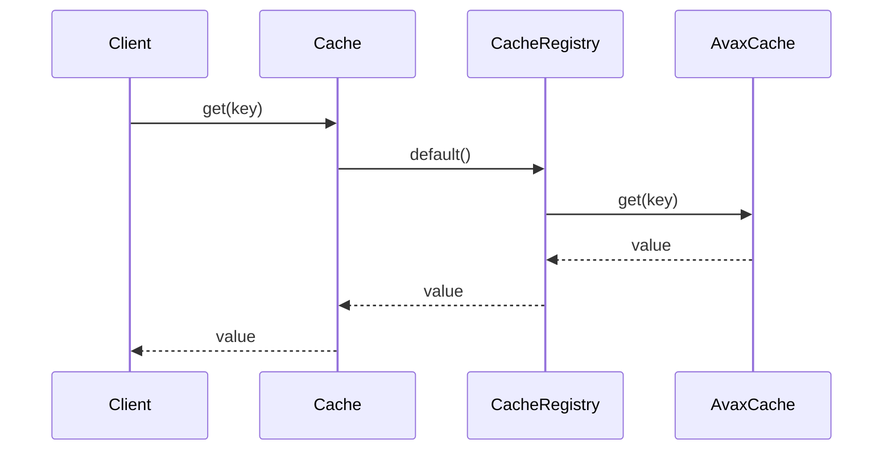

# Public Surface

The developer-facing entrypoint layer. This is what users see first.

## User Mental Model

```php
// Simple usage
Cache::get('key');
Cache::put('key', $value, ttl: 3600);
Cache::remember('key', 3600, fn () => $loader->load());
Cache::forget('key');

// Named stores
Cache::use($customCache, 'api');
Cache::store('api')->get('key');

// Compiled artifacts
CompiledCache::read('routes', $builder, $sources);
CompiledCache::clear('routes');
```

## Three Public Entrypoints

### 1. Cache (runtime cache)

- Main facade for 95% of usage
- Static methods: `get`, `set`, `put`, `remember`, `forget`, `clear`, `has`
- Testable via `Cache::use()` and `Cache::reset()`

### 2. CompiledCache (framework artifacts)

- Separate facade for compiled artifacts
- Methods: `read`, `compile`, `clear`, `clearAll`
- Not PSR-16 cache

### 3. BuildCache / BuildCompiledCache (builders)

- Manual composition for advanced setup
- Tests and framework bootstrapping

## Main Flow



## Key Principles

1. **Facade has no real logic** - delegates to registry
2. **Registry owns named instances** - not behavior
3. **Separate compiled facade** - different concerns
4. **Test-friendly** - use() + reset() pattern