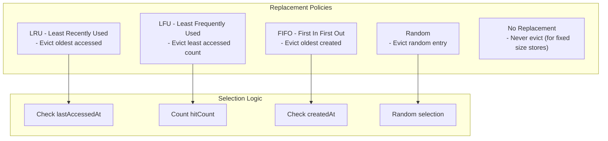

# AvaxCache Replacement Policy Model

## Overview

When cache capacity is reached, AvaxCache must decide which entry to evict. The replacement policy determines this
decision.

## Supported Policies



## Policy Comparison

| Policy | Best For        | Worst For            | Complexity |
|--------|-----------------|----------------------|------------|
| LRU    | General purpose | Sequential scans     | O(n)       |
| LFU    | Popular items   | New items            | O(n)       |
| FIFO   | Simple cases    | Recently added items | O(1)       |
| Random | Testing         | Production           | O(1)       |

## LRU (Least Recently Used)

```php
$policy = new LeastRecentlyUsedReplacement();

// Given entries with lifecycle metadata:
$entries = [
    'key1' => $lifecycle1, // accessed 10 minutes ago
    'key2' => $lifecycle2, // accessed 5 minutes ago
    'key3' => $lifecycle3, // accessed 1 minute ago
];

$toEvict = $policy->choose($entries);
// Returns 'key1' (least recently accessed)
```

### Usage

```php
$evictor = new EvictCachedValue(
    store: $store,
    clock: $clock,
    policy: new LeastRecentlyUsedReplacement()
);

$evictor->evictUntilCapacityIsSafe($entries, maxCapacity: 1000);
```

## LFU (Least Frequently Used)

```php
$policy = new LeastFrequentlyUsedReplacement();

// Given entries with lifecycle metadata:
$entries = [
    'key1' => $lifecycle1, // hitCount: 5
    'key2' => $lifecycle2, // hitCount: 100
    'key3' => $lifecycle3, // hitCount: 2
];

$toEvict = $policy->choose($entries);
// Returns 'key3' (least frequently used)
```

## FIFO (First In First Out)

```php
$policy = new FirstInFirstOutReplacement();

// Given entries with lifecycle metadata:
$entries = [
    'key1' => $lifecycle1, // createdAt: 1 hour ago
    'key2' => $lifecycle2, // createdAt: 30 minutes ago
    'key3' => $lifecycle3, // createdAt: 5 minutes ago
];

$toEvict = $policy->choose($entries);
// Returns 'key1' (oldest created)
```

## Random Replacement

```php
$policy = new RandomReplacement();

$entries = ['key1' => $lifecycle1, 'key2' => $lifecycle2];

$toEvict = $policy->choose($entries);
// Returns random entry
```

## No Replacement

```php
$policy = new NoReplacement();

// Never returns a key for eviction
$toEvict = $policy->choose($entries);
// Always returns null
```

## Custom Policies

```php
interface ChooseCachedValueForReplacement
{
    /**
     * @param array<string, CachedValueLifecycle> $entries
     */
    public function choose(array $entries): ?string;
}

// Custom policy implementation
final readonly class SizeAwareReplacement implements ChooseCachedValueForReplacement
{
    public function choose(array $entries): ?string
    {
        // Evict largest entry when capacity is needed
        $largest = null;
        $maxSize = 0;

        foreach ($entries as $key => $lifecycle) {
            $size = strlen(serialize($lifecycle->value));

            if ($size > $maxSize) {
                $maxSize = $size;
                $largest = $key;
            }
        }

        return $largest;
    }
}
```

## Integration with Eviction Flow

```php
$evictor = new EvictCachedValue(
    store: $store,
    clock: $clock,
    policy: new LeastRecentlyUsedReplacement(),
    metrics: $metrics
);

// Evict entries until capacity is safe
$evicted = $evictor->evictUntilCapacityIsSafe(
    entries: $currentEntries,
    maxCapacity: 1000
);

echo "Evicted {$evicted} entries";
```

## Best Practices

1. **LRU for general use**: Good balance of simplicity and effectiveness
2. **LFU for stable access patterns**: When popular items should stay
3. **FIFO for simple implementations**: When recency doesn't matter
4. **Random for testing**: Simple to implement and test
5. **Track metrics**: Monitor eviction rates to tune policies