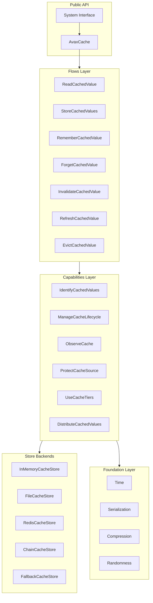
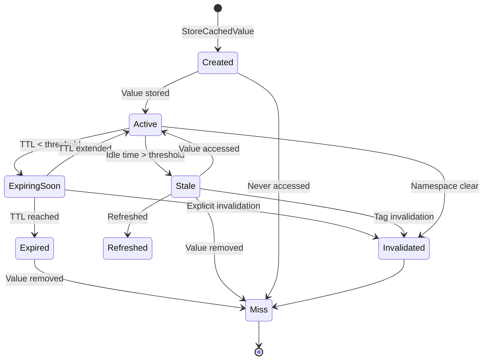
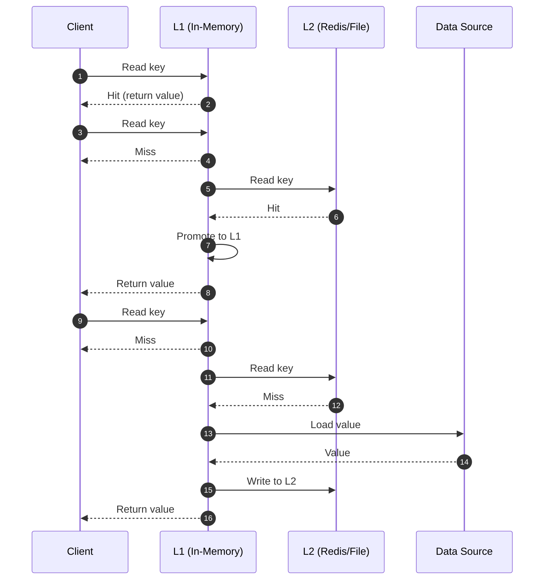
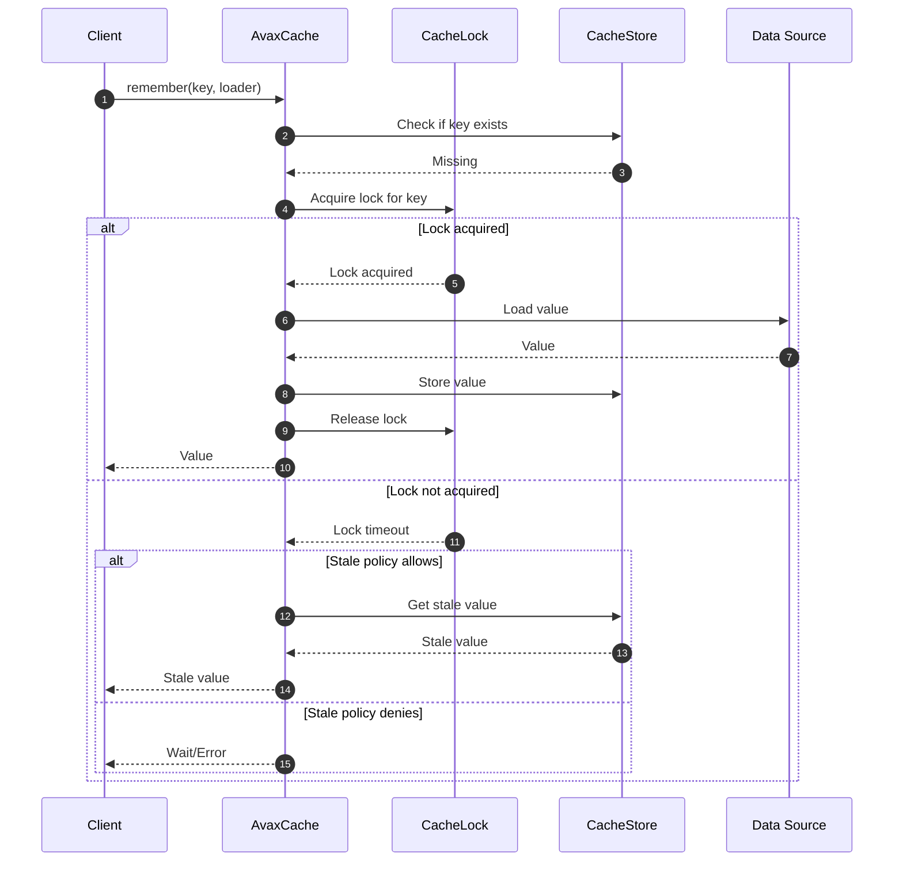
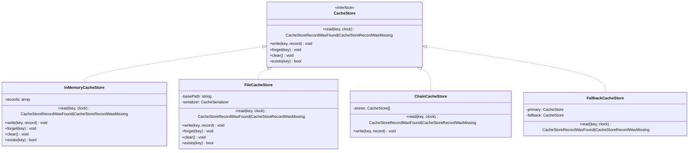

# AvaxCache System Design

## Architecture Overview

AvaxCache follows a **system-design approach** where cache is treated as a value lifecycle management system, not just a
key-value store.



## Value Lifecycle



## Multi-tier System Flow



## Stampede Protection



## Store Abstraction



## Key Design Decisions

### 1. System Miss !== Stored Null

```php
$cache->set('key', null);
$cache->get('key'); // Returns null, NOT default

$cache->delete('key');
$cache->get('key'); // Returns default
```

### 2. Expired !== Stale

- **Expired**: Past TTL, must be refreshed or removed
- **Stale**: Old but potentially servable while refreshing
- **Missing**: Key does not exist in cache

### 3. Clock Dependency

All time-related operations use injected `Clock` to support:

- Deterministic testing with `FrozenClock`
- Time manipulation for cache testing
- Proper separation of concerns

### 4. Small Public API

The public API intentionally limits exposure to:

- Reduce cognitive load
- Prevent misuse
- Allow internal evolution without breaking changes
- Maintain clear ownership boundaries