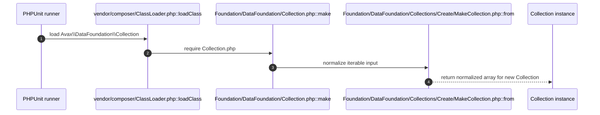

# DataFoundation How This Works

## What this folder is

This folder is the system root for semantic data work in PHP.
It owns raw array ergonomics, fluent generic collections, semantic values, composites, structures, flows, and interop
boundaries.

## Real commands or triggers that reach this folder

- `php vendor/bin/phpunit tests/Foundation/DataFoundation`
- Any application code that instantiates `Avax\DataFoundation\Arrhae`, `Avax\DataFoundation\Collection`, or another
  public DataFoundation type

## Exact upstream handoffs

- `vendor/composer/ClassLoader.php`
- function: `loadClass($class)`
- Composer autoload -> `Foundation/DataFoundation/<Type>.php`

## The simplest story

- App code asks for a public data type such as `Collection`, `Option`, or `Queue`
- The root type enforces its invariant or delegates mechanical work to `Internal/` and capability slices
- The type returns a new immutable value or a stable converted shape

## The first important path

When you type:

```bash
php vendor/bin/phpunit tests/Foundation/DataFoundation
```

the important path is:



- **Step 1:** Composer loads the requested public DataFoundation class
- **Step 2:** The root type validates or normalizes input
- **Step 3:** Internal atoms or capability slices perform the mechanical work
- **Step 4:** The caller receives a semantically honest immutable value

## Direct files in this folder

### Arrhae.php

This is the file where raw array ergonomics live.

When the story opens this file:

- app code -> Composer autoload -> `Foundation/DataFoundation/Arrhae.php`

What arrives here:

- array-like input
- dot-path reads and writes

What leaves this file:

- a new `Arrhae` instance
- converted array, JSON, or XML output

Why you open it first:

- raw array behavior looks wrong
- dot-path manipulation behaves unexpectedly

### Collection.php

This is the file where fluent generic collection behavior lives.

When the story opens this file:

- app code -> Composer autoload -> `Foundation/DataFoundation/Collection.php`

What arrives here:

- iterable input
- fluent transform, aggregate, search, and ordering requests

What leaves this file:

- a new `Collection` instance
- aggregate values
- semantic `Pair` output for `pull()`

Why you open it first:

- fluent chains return the wrong shape
- immutable write-like behavior is inconsistent

## Child folders in this folder

### Contracts/

Open `Contracts/how-this-works.md`.

Use it when:

- you need the public facade contracts
- you are changing root type signatures

### Exceptions/

Open `Exceptions/how-this-works.md`.

Use it when:

- invariants fail
- conversion or mutation errors need naming review

### Internal/

Open `Internal/how-this-works.md`.

Use it when:

- a public type needs neutral mechanics
- you are separating semantics from substrate

### Values/

Open `Values/how-this-works.md`.

Use it when:

- you need a semantic value object
- you are replacing primitive obsession

### Composites/

Open `Composites/how-this-works.md`.

Use it when:

- one value must carry multiple slots honestly
- a state transition needs a public composite return type

### Collections/

Open `Collections/how-this-works.md`.

Use it when:

- you need array-backed collection semantics
- you are extending collection families

### Structures/

Open `Structures/how-this-works.md`.

Use it when:

- access order matters
- you need stack, queue, deque, or tree invariants

### Flows/

Open `Flows/how-this-works.md`.

Use it when:

- work must move through staged processing
- you need lazy or windowed iteration

### Interop/

Open `Interop/how-this-works.md`.

Use it when:

- data crosses array, iterable, JSON, XML, or generator boundaries
- you are wiring DataFoundation into external IO shapes

## Debug first

- start in `Collection.php::pull()` when remove-and-return behavior looks inconsistent
- start in `Internal/Mutability/MutationGuard.php::assertMutable()` when immutable writes unexpectedly fail

## What to remember

- public semantics stay in root and lane-level public types
- `Internal/` is substrate, not user-facing DX
- `DataFoundation` is the only production implementation now

## Dictionary

- `Arrhae`: raw array facade with dot-path ergonomics
- `Collection`: fluent generic collection engine
- `lane`: a public type family with one coherent job
