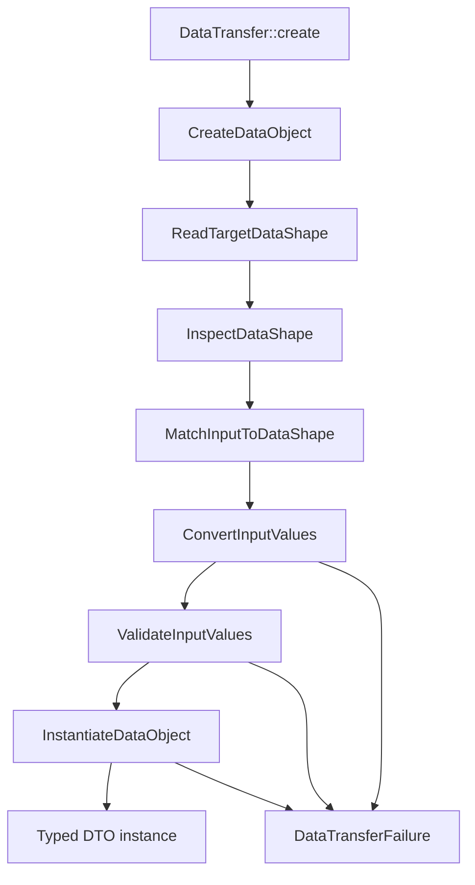

Brutalno: ovo ne bih radio kao običan refactor. Ovo je **targeted rewrite / redesign** DTO komponente. Ne zato što trenutni kod nema vrednost, nego zato što mu je centralna osovina pogrešna.

Trenutno `AbstractDTO` skuplja hydration, casting, attributes, inspection i serialization kroz traits, dok `Reflector` ponovo koristi sličan skup traitova i radi hydration/inspection/serialization oko target objekta. To znači da sistem ima dva centra moći: DTO baza i reflektorski runtime. To je dual-axis problem. Po tvojim how-to pravilima, struktura mora da čita kao flow → slice → unit → exact action, a ne kao `Traits/Support` skladište tehničkih sposobnosti.

## Odluka - implementiraj plan strogo po pravilima how-to-*.md dokumenata iz foldera AI Prompts.

**🚨 Rewrite Candidate, ali kontrolisani rewrite.**

Ne brišeš sve napamet. Prvo zaključavaš trenutno ponašanje characterization testovima, pa praviš novu DTO arhitekturu i migriraš deo po deo.

Glavna promena: **DTO više ne sme biti “pametna bazna klasa”. DTO treba da bude običan data object. Pamet treba da živi u DataTransfer runtime-u.**

Drugim rečima:

```php
final readonly class CreateUserData
{
    public function __construct(
        public string $name,
        public string $email,
        public UserRole $role,
    ) {}
}
```

A runtime radi ovo:

```php
$userData = DataTransfer::create(
    class: CreateUserData::class,
    input: $payload,
);
```

DTO ostaje čist. Runtime radi mapiranje, coercion, validation, diagnostics, serialization.

---

# Predloženi naziv komponente

Ne bih više držao ovo pod:

```text
ObjectHandling/DTO
```

To zvuči tehnički i mutno.

Bolji root:

```text
DataTransfer/
```

Zašto? Zato što DTO nije samo “object handling”. DTO sistem realno radi:

* prima spoljne podatke
* čita oblik ciljne klase
* mapira input
* pretvara vrednosti
* validira pravila
* kreira data object
* serializuje data object nazad

To je **data transfer**, ne “object handling”.

Ako želiš da zadržiš ime `DTO`, onda `DTO` treba da bude public facade, a ne cela unutrašnja arhitektura.

---

# Idealni project tree

Ovo je tree koji bih ja ciljao.

```text
DataTransfer/
├── DataTransfer.php
├── DataTransferException.php
├── DataObject.php
├── DataTransferResult.php
│
├── CreateDataObject/
│   ├── CreateDataObject.php
│   ├── ReadTargetDataShape.php
│   ├── MatchInputToDataShape.php
│   ├── ResolveFieldInputValue.php
│   ├── ConvertInputValues.php
│   ├── ValidateInputValues.php
│   ├── InstantiateDataObject.php
│   ├── ReportDataObjectCreationFailure.php
│   └── how-this-works.md
│
├── ReadDataObject/
│   ├── ReadDataObject.php
│   ├── ReadDataObjectValues.php
│   ├── ReadVisibleDataFields.php
│   ├── NormalizeDataObjectValue.php
│   └── how-this-works.md
│
├── SerializeDataObject/
│   ├── SerializeDataObject.php
│   ├── ConvertDataObjectToArray.php
│   ├── ConvertDataObjectToJson.php
│   ├── ConvertDataObjectToFlatArray.php
│   ├── ConvertDataObjectToStdClass.php
│   ├── ConvertDataObjectToJsonApi.php
│   └── how-this-works.md
│
├── InspectDataShape/
│   ├── InspectDataShape.php
│   ├── ReadClassDataShape.php
│   ├── ReadConstructorDataFields.php
│   ├── ReadPublicDataFields.php
│   ├── ReadDataFieldAttributes.php
│   ├── CacheDataShape.php
│   ├── DataShape.php
│   ├── DataField.php
│   ├── DataFieldType.php
│   └── how-this-works.md
│
├── Capabilities/
│   ├── FieldMapping/
│   │   ├── FieldInputName.php
│   │   ├── MapInputNameToField.php
│   │   ├── ReadMappedInputName.php
│   │   └── how-this-works.md
│   │
│   ├── ValueConversion/
│   │   ├── ConvertValueToDeclaredType.php
│   │   ├── ConvertValueToScalar.php
│   │   ├── ConvertValueToEnum.php
│   │   ├── ConvertValueToNestedDataObject.php
│   │   ├── ConvertValueToDataObjectList.php
│   │   ├── ConvertValueWithCustomCaster.php
│   │   ├── ValueConversionFailed.php
│   │   └── how-this-works.md
│   │
│   ├── FieldValidation/
│   │   ├── ValidateRequiredField.php
│   │   ├── ValidateNullableField.php
│   │   ├── ValidateFieldRules.php
│   │   ├── FieldValidationFailed.php
│   │   ├── DataValidationFailed.php
│   │   └── how-this-works.md
│   │
│   ├── FieldVisibility/
│   │   ├── ReadVisibleFields.php
│   │   ├── HideFieldFromOutput.php
│   │   ├── ShouldExposeField.php
│   │   └── how-this-works.md
│   │
│   ├── ErrorReporting/
│   │   ├── DataTransferFailure.php
│   │   ├── DataTransferViolation.php
│   │   ├── DataTransferViolations.php
│   │   ├── ExplainDataTransferFailure.php
│   │   └── how-this-works.md
│   │
│   └── Attributes/
│       ├── MapFrom.php
│       ├── ListOf.php
│       ├── CastWith.php
│       ├── Hidden.php
│       ├── Optional.php
│       ├── Required.php
│       ├── DefaultValue.php
│       └── how-this-works.md
│
├── Configuration/
│   ├── DataTransferConfig.php
│   ├── DataTransferBuilder.php
│   ├── RegisterValueCaster.php
│   ├── RegisterValidationRule.php
│   ├── RegisterNamingPolicy.php
│   └── how-this-works.md
│
├── Foundation/
│   ├── ClassName.php
│   ├── FieldName.php
│   ├── FieldPath.php
│   ├── InputData.php
│   ├── OutputData.php
│   └── how-this-works.md
│
└── Compatibility/
    ├── LegacyAbstractDTO.php
    ├── CreateLegacyDTO.php
    ├── SerializeLegacyDTO.php
    └── how-this-works.md
```

Napomena: `Compatibility/` postoji samo ako moraš da sačuvaš postojeći `AbstractDTO` API dok migriraš. Ako nemaš backward compatibility obavezu, izbaci ga.

---

# Šta se iz trenutnog sistema razbija i gde ide

```text
AbstractDTO
→ Compatibility/LegacyAbstractDTO.php
→ dugoročno deprecated

Reflector
→ InspectDataShape/InspectDataShape.php
→ CreateDataObject/ReadTargetDataShape.php
→ SerializeDataObject/ReadDataObjectValues.php

Traits/CastsTypes
→ Capabilities/ValueConversion/*

Traits/HandlesHydration
→ CreateDataObject/*

Traits/HandlesAttributes
→ Capabilities/Attributes/*
→ Capabilities/FieldValidation/*
→ Capabilities/ValueConversion/ConvertValueWithCustomCaster.php

Traits/InspectsProperties
→ InspectDataShape/*

Traits/Serialization
→ SerializeDataObject/*

Support/PropertyMetadata
→ InspectDataShape/DataField.php
→ InspectDataShape/DataFieldType.php

DTOValidationException
→ Capabilities/ErrorReporting/DataValidationFailed.php
→ Capabilities/ErrorReporting/DataTransferViolation.php
```

Ovo je mnogo čistije jer svaka stvar dobija stvarnog vlasnika. Nema više “Support” i “Traits” kao tehničkih kutija. Tvoja dokumentacija izričito traži da folderi i fajlovi imaju jasan razlog postojanja, da se sve rekurzivno dokumentuje i da se objasni zašto nešto postoji baš tu.

---

# Centralna osovina novog sistema

Jedna rečenica:

**Ovaj sistem je organizovan oko kreiranja i čitanja typed data object-a kroz eksplicitan DataTransfer runtime.**

Ne oko `AbstractDTO`.

Ne oko `Reflector`.

Ne oko traitova.

Ne oko atributa.

Atributi su samo DSL metadata. Reflection je samo alat. Runtime je osovina.

---

# Minimalni public API

Public API treba da bude mali, dosadan i moćan.

```php
DataTransfer::create(class: UserData::class, input: $payload);

DataTransfer::tryCreate(class: UserData::class, input: $payload);

DataTransfer::toArray($dataObject);

DataTransfer::toJson($dataObject);

DataTransfer::inspect(UserData::class);
```

Opcionalno, ako želiš fluent stil:

```php
DataTransfer::for(UserData::class)->create($payload);

DataTransfer::for(UserData::class)->tryCreate($payload);

DataTransfer::for(UserData::class)->shape();
```

Ne bih preterivao sa magijom. Moć treba da bude u stabilnom runtime-u, ne u “wow” sintaksi.

---

# Idealne sposobnosti DTO sistema

DTO sistem treba da podrži:

1. Native constructor DTOs

```php
final readonly class UserData
{
    public function __construct(
        public string $name,
        public string $email,
    ) {}
}
```

2. Public-property legacy DTOs, samo ako mora

```php
final class LegacyUserData
{
    public string $name;
    public string $email;
}
```

3. Enum conversion

```php
final readonly class UserData
{
    public function __construct(
        public UserRole $role,
    ) {}
}
```

4. Nested DTO

```php
final readonly class UserData
{
    public function __construct(
        public AddressData $address,
    ) {}
}
```

5. List of DTOs

```php
final readonly class UserData
{
    public function __construct(
        #[ListOf(AddressData::class)]
        public array $addresses,
    ) {}
}
```

6. Input mapping

```php
final readonly class UserData
{
    public function __construct(
        #[MapFrom('user_name')]
        public string $name,
    ) {}
}
```

7. Hidden output fields

```php
final readonly class UserData
{
    public function __construct(
        #[Hidden]
        public string $passwordHash,
    ) {}
}
```

8. Custom caster

```php
final readonly class UserData
{
    public function __construct(
        #[CastWith(MoneyCaster::class)]
        public Money $balance,
    ) {}
}
```

9. Structured errors

Umesto samo string poruke, error mora da zna:

```text
field path
expected type
actual value type
failed rule
human message
machine code
previous exception
```

10. Reflection caching

Reflection ne sme da bude rasuta po hot path-u. `InspectDataShape` čita reflection jednom, pravi `DataShape`, cache-ira ga i ostali flow-ovi rade nad tim modelom.

---

# Glavni flow



Ovo je bitno: sada se tačno vidi ko je owner flow-a. Trenutni sistem to skriva kroz traitove i reflektorsku klasu.

---

# Plan refaktora

## Faza 1: Zaključaj trenutno ponašanje

Prvo testovi. Bez toga je rewrite hazard.

ToDo:

```text
[ ] Napisati characterization testove za postojeći AbstractDTO constructor hydration.
[ ] Testirati missing required field.
[ ] Testirati nullable field fallback.
[ ] Testirati default property fallback.
[ ] Testirati nested DTO casting.
[ ] Testirati DTO[] casting preko @var ili postojećeg attribute mehanizma.
[ ] Testirati backed enum casting.
[ ] Testirati invalid enum value.
[ ] Testirati Hidden attribute u serialization flow-u.
[ ] Testirati toArray().
[ ] Testirati toJson().
[ ] Testirati toFlatArray().
[ ] Testirati toStdClass().
[ ] Testirati toJsonApi().
[ ] Testirati DTOValidationException format.
[ ] Testirati ReflectionException failure path ako postoji realan scenario.
```

## Faza 2: Uvedi novi root `DataTransfer/`

ToDo:

```text
[ ] Kreirati DataTransfer/ root.
[ ] Dodati DataTransfer.php kao jedini glavni public facade.
[ ] Dodati DataObject.php marker interface samo ako realno koristiš za type narrowing.
[ ] Dodati DataTransferException.php kao root exception contract.
[ ] Dodati DataTransferResult.php za tryCreate() flow.
[ ] Ne prebacivati staru logiku odmah.
[ ] Ne dodavati traits.
[ ] Ne dodavati Support, Helpers, Utils, Common.
```

## Faza 3: Napravi `InspectDataShape`

Ovo je temelj. Bez dobrog shape modela sve ostalo postaje mutno.

ToDo:

```text
[ ] Kreirati InspectDataShape/InspectDataShape.php kao root owner.
[ ] Kreirati ReadClassDataShape.php.
[ ] Kreirati ReadConstructorDataFields.php.
[ ] Kreirati ReadPublicDataFields.php samo za legacy mode.
[ ] Kreirati ReadDataFieldAttributes.php.
[ ] Kreirati CacheDataShape.php.
[ ] Kreirati immutable DataShape.
[ ] Kreirati immutable DataField.
[ ] Kreirati DataFieldType.
[ ] Podržati constructor promoted properties kao prvi izbor.
[ ] Podržati readonly DTO klase kao idealni oblik.
[ ] Podržati public properties samo kroz compatibility mode.
[ ] Uvesti cache po class-string.
[ ] Zabraniti mutaciju DataShape nakon kreiranja.
```

## Faza 4: Napravi `CreateDataObject`

ToDo:

```text
[ ] Kreirati CreateDataObject/CreateDataObject.php kao root flow owner.
[ ] Flow mora da radi: class + input -> typed object.
[ ] Dodati ReadTargetDataShape.php.
[ ] Dodati MatchInputToDataShape.php.
[ ] Dodati ResolveFieldInputValue.php.
[ ] Dodati ConvertInputValues.php.
[ ] Dodati ValidateInputValues.php.
[ ] Dodati InstantiateDataObject.php.
[ ] Dodati ReportDataObjectCreationFailure.php.
[ ] Zabraniti tiho ignorisanje invalid input-a osim ako config eksplicitno kaže drugačije.
[ ] Dodati policy za unknown fields: reject / ignore / collect.
[ ] Dodati policy za missing fields.
[ ] Dodati field path za nested greške: address.city, items.0.price.
```

## Faza 5: Izvuci `ValueConversion`

ToDo:

```text
[ ] Kreirati Capabilities/ValueConversion.
[ ] Implementirati ConvertValueToDeclaredType.php.
[ ] Implementirati ConvertValueToScalar.php.
[ ] Implementirati ConvertValueToEnum.php.
[ ] Implementirati ConvertValueToNestedDataObject.php.
[ ] Implementirati ConvertValueToDataObjectList.php.
[ ] Implementirati ConvertValueWithCustomCaster.php.
[ ] Implementirati ValueConversionFailed.php.
[ ] Svaki converter mora imati jasan input/output contract.
[ ] Nijedan converter ne sme da zna za ceo DTO flow.
[ ] Converter sme da zna samo field, target type, value, context.
```

## Faza 6: Izvuci `FieldValidation`

ToDo:

```text
[ ] Kreirati Capabilities/FieldValidation.
[ ] Implementirati ValidateRequiredField.php.
[ ] Implementirati ValidateNullableField.php.
[ ] Implementirati ValidateFieldRules.php.
[ ] Implementirati FieldValidationFailed.php.
[ ] Implementirati DataValidationFailed.php.
[ ] Svaka validacija mora vraćati strukturisanu grešku, ne samo string.
[ ] Razdvojiti programmer error od input validation error-a.
[ ] Ne mešati validation sa castingom.
```

## Faza 7: Izvuci `FieldMapping`

ToDo:

```text
[ ] Kreirati Capabilities/FieldMapping.
[ ] Implementirati MapInputNameToField.php.
[ ] Implementirati ReadMappedInputName.php.
[ ] Implementirati FieldInputName.php.
[ ] Dodati #[MapFrom('external_name')].
[ ] Dodati naming policy ako treba: snake_case -> camelCase.
[ ] Naming policy mora biti configuration concern, ne hardcoded helper.
```

## Faza 8: Izvuci `SerializeDataObject`

ToDo:

```text
[ ] Kreirati SerializeDataObject/SerializeDataObject.php.
[ ] Implementirati ConvertDataObjectToArray.php.
[ ] Implementirati ConvertDataObjectToJson.php.
[ ] Implementirati ConvertDataObjectToFlatArray.php.
[ ] Implementirati ConvertDataObjectToStdClass.php.
[ ] Implementirati ConvertDataObjectToJsonApi.php.
[ ] Implementirati circular reference protection ako je relevantno.
[ ] Implementirati depth limit.
[ ] Implementirati Hidden field behavior kroz FieldVisibility capability.
[ ] JSON encoding mora koristiti JSON_THROW_ON_ERROR.
```

## Faza 9: Error reporting

ToDo:

```text
[ ] Kreirati Capabilities/ErrorReporting.
[ ] Implementirati DataTransferFailure.php.
[ ] Implementirati DataTransferViolation.php.
[ ] Implementirati DataTransferViolations.php.
[ ] Implementirati ExplainDataTransferFailure.php.
[ ] Svaka greška mora imati machine code.
[ ] Svaka greška mora imati human message.
[ ] Svaka field greška mora imati field path.
[ ] Exception message sme biti lep, ali source of truth mora biti strukturisani violation object.
```

## Faza 10: Compatibility layer

ToDo:

```text
[ ] Premestiti postojeći AbstractDTO u Compatibility/LegacyAbstractDTO.php.
[ ] Zadržati stari constructor array hydration privremeno.
[ ] Dodati @deprecated poruku.
[ ] Napraviti adapter koji koristi novi CreateDataObject flow ispod haube.
[ ] Ukloniti direktno korišćenje starih traits iz public DTO klase.
[ ] Dokumentovati migration path.
```

## Faza 11: Dokumentacija po how-to pravilima

Tvoji dokumentacioni fajlovi traže da dokumentacija živi u `docs/`, da prati source strukturu, da svaki ownership folder ima `how-this-works.md`, i da dokumentacija objasni intent, trade-off, failure path i realan flow, ne samo sintaksu.

ToDo:

```text
[ ] Kreirati docs/DataTransfer/how-this-works.md.
[ ] Kreirati docs/DataTransfer/CreateDataObject/how-this-works.md.
[ ] Kreirati docs/DataTransfer/InspectDataShape/how-this-works.md.
[ ] Kreirati docs/DataTransfer/SerializeDataObject/how-this-works.md.
[ ] Kreirati docs/DataTransfer/Capabilities/ValueConversion/how-this-works.md.
[ ] Kreirati docs/DataTransfer/Capabilities/FieldValidation/how-this-works.md.
[ ] Kreirati docs/DataTransfer/Capabilities/FieldMapping/how-this-works.md.
[ ] Kreirati docs/DataTransfer/Capabilities/ErrorReporting/how-this-works.md.
[ ] Svaki how-this-works.md mora imati frontmatter.
[ ] Svaki sequential flow mora imati mermaid sequenceDiagram.
[ ] U dijagramima koristiti realne file/function nazive.
[ ] Dokumentovati gde se debug-uje prvi failure.
```

---

# Pravila za Codex / AI agenta

Ovo bih mu dao bukvalno:

```md
Refactor the current ObjectHandling/DTO component into a new DataTransfer component.

Follow all how-to-*.md governance files strictly.

Non-negotiable architecture rules:
- folder says flow or capability
- file says responsibility
- function says exact action
- no Helpers, Utils, Support, Common, Services, Managers, or vague bucket folders
- no trait soup
- no smart AbstractDTO as the central runtime
- DTO classes must be plain typed data objects first
- DataTransfer runtime owns creation, inspection, conversion, validation, serialization, and diagnostics
- public API must be small and stable
- internal machinery must be hidden behind flow owners and capabilities
- reflection must be isolated inside InspectDataShape and cached
- all errors must be structured and explainable
- preserve existing behavior through characterization tests before replacing internals
- write documentation in docs/ and mirror source structure
- every ownership folder must have how-this-works.md

Target decision:
This is a controlled rewrite candidate, not a cosmetic refactor.

Implementation order:
1. Add characterization tests for current DTO behavior.
2. Create DataTransfer root.
3. Build InspectDataShape.
4. Build CreateDataObject.
5. Extract ValueConversion.
6. Extract FieldValidation.
7. Extract FieldMapping.
8. Build SerializeDataObject.
9. Add structured error reporting.
10. Add compatibility layer for LegacyAbstractDTO.
11. Add docs and how-this-works.md files.
12. Remove old traits only after tests prove parity.
```

---

# Najvažniji rez

Ako hoćeš da ovo bude “da framework-ci žare”, onda ne pravi još jednu pametnu `AbstractDTO` klasu.

To je stari stil.

Idealni DTO sistem u PHP 8.5 treba da bude:

```text
Plain DTOs outside.
Explicit runtime inside.
Tiny public API.
Cached reflection.
Structured failures.
Attribute DSL only where it adds clarity.
Zero trait soup.
Zero generic buckets.
```

To je smer. Sve drugo će izgledati moćno, ali će vremenom postati magla.
