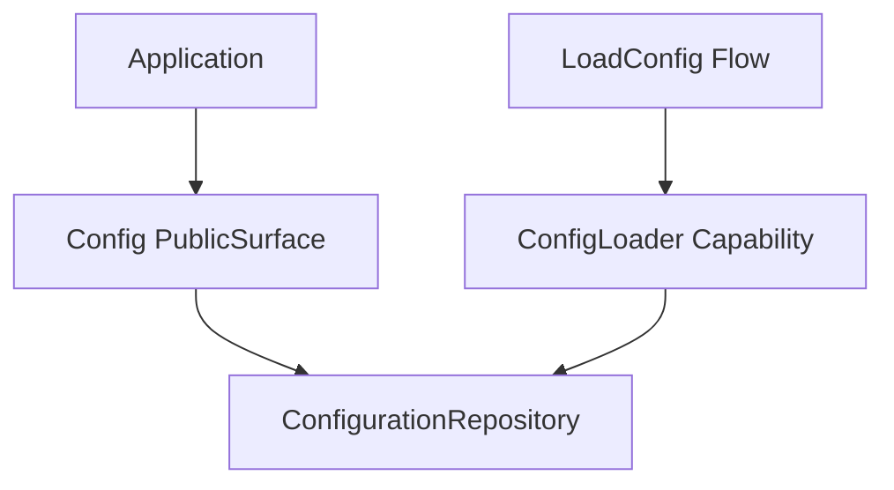

# How This Works: Configuration Component

The Configuration component manages application settings through a centralized repository with dot-notation support. It
decouples configuration storage from retrieval logic and provides a unified public surface for all components.

## Architecture Topology



## Key Components

### 1. ConfigurationRepository

The core storage for all configuration data.

- Supports dot-notation for nested keys (e.g., `database.connections.mysql.host`).
- Provides `get`, `set`, `has`, and `all` methods.
- Supports `merge` for recursive configuration updates.

### 2. Config (Public Surface)

The primary entry point for accessing configuration.

- Acts as a thin proxy to the repository.
- **Strict Behavior**: Throws `RuntimeException` if a requested key does not exist and no default value is provided.
- Safe retrieval with defaults: `Config::get(key: 'missing', default: 'fallback')`.

### 3. ConfigLoader

Responsible for loading configuration from the filesystem.

- Supports loading single PHP files (must return an array).
- Supports loading entire directories, where each file name becomes a top-level configuration namespace.

## Usage Example

```php
// Via Public Surface
$config->get(key: 'app.name');

// Via Helper (Global)
config(key: 'database.host', default: 'localhost');
```

## Failure Behavior

- **Missing File**: `ConfigLoader` throws `RuntimeException` if a requested file cannot be found.
- **Invalid Payload**: `ConfigLoader` throws `RuntimeException` if a configuration file does not return an array.
- **Missing Key**: `Config::get` throws `RuntimeException` if a key is missing and no default is specified to prevent
  silent failures in production.

## Performance

Configuration is typically loaded during application bootstrap. For high-performance environments, the `CompiledCache`
capability (owned by the Cache component) can be used to serialize the merged configuration repository.

## Where to Debug First

1. **Parsing Errors**: `Avax\Components\Application\Config\System\Capabilities\Parsers`.
2. **Cache Hits/Misses**: `Avax\Components\Application\Config\System\Capabilities\CompiledCache`.

## Evidence

- `components/Application/Config/`
