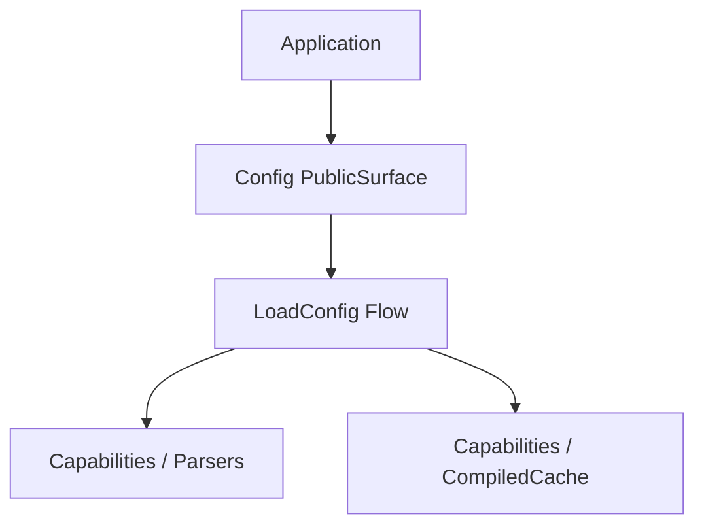

# How This Works: Configuration Component

The Configuration component manages the retrieval, parsing, and caching of application-level settings.

## Architecture Topology

## Key Flows

### 1. Config Loading

Loads settings from `.env` or PHP files, merges them, and optionally stores them in a `CompiledCache` for near-zero I/O
overhead in production.

## Where to Debug First

1. **Parsing Errors**: `Avax\Components\Application\Config\System\Capabilities\Parsers`.
2. **Cache Hits/Misses**: `Avax\Components\Application\Config\System\Capabilities\CompiledCache`.

## Evidence

- `components/Application/Config/`
