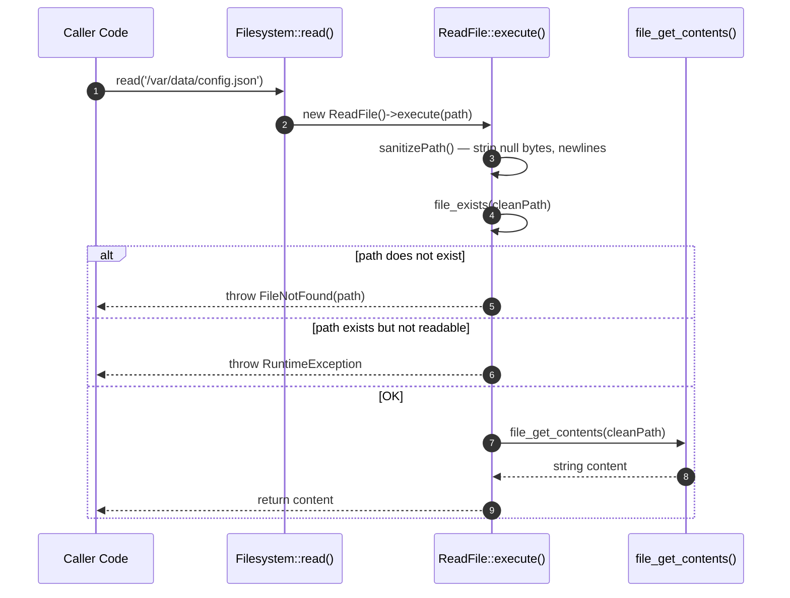
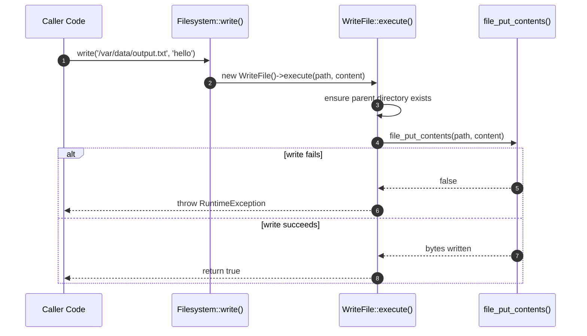

# Filesystem Component How This Works

## What This Component Does

This component provides safe local filesystem operations for the AvaX framework. It wraps PHP's native filesystem functions (`file_get_contents`, `file_put_contents`, `chmod`, etc.) behind a flow-driven architecture that enforces path traversal protection, permission validation, and explicit failure behavior.

Every operation goes through a dedicated Flow class. The `Filesystem` public surface is a thin facade — it creates the appropriate flow and delegates to it. No private state is held on the facade.

## What This Component Does NOT Do

- **Does not provide cloud storage** — S3, Azure Blob, GCS, and other remote backends are the responsibility of the Storage component, which sits on top of this one.
- **Does not manage file uploads** — HTTP upload handling is a separate concern (validation, multipart parsing, tmp file management).
- **Does not provide a virtual filesystem** — there is no in-memory or mock filesystem built in; tests use real paths or the Storage component's `MemoryDisk`.
- **Does not do content-type detection** — MIME type resolution is not part of this component's responsibility.
- **Does not provide file locking** — `flock()` and advisory locks are not wrapped here.

## Public API

The public surface is `Avax\Components\Application\Filesystem\System\PublicSurface\Filesystem`. It is a `final` class with no private state. Each method instantiates its flow on demand.

```php
use Avax\Components\Application\Filesystem\System\PublicSurface\Filesystem;

$fs = new Filesystem();

// Read a file's contents (throws FileNotFound if missing)
$content = $fs->read('/path/to/file.txt');

// Write content to a file (creates parent directories if needed)
$fs->write('/path/to/file.txt', 'hello world');

// Append to an existing file
$fs->append('/path/to/log.txt', "\nnew line");

// Copy a file
$fs->copy('/src/file.txt', '/dst/file.txt');

// Move a file
$fs->move('/tmp/upload.txt', '/storage/upload.txt');

// Delete a file
$fs->delete('/path/to/old.txt');

// Check if a path exists
$exists = $fs->exists('/path/to/file.txt');

// Create a directory (default permissions 0755)
$fs->createDirectory('/path/to/new-dir');

// Delete a directory (recursive)
$fs->deleteDirectory('/path/to/dir');

// Clear a directory (remove contents, keep the directory)
$fs->clearDirectory('/path/to/dir');

// List directory contents (returns array of paths)
$entries = $fs->listDirectory('/path/to/dir');

// Check readability / writability
$readable = $fs->isReadable('/path/to/file.txt');
$writable = $fs->isWritable('/path/to/file.txt');

// Get / change permissions
$perms = $fs->permissions('/path/to/file.txt');     // returns int|null
$fs->changePermissions('/path/to/file.txt', 0o644);
```

### Method-to-Flow Mapping

| Public Method        | Flow Class           | What It Does                              |
|----------------------|----------------------|-------------------------------------------|
| `read($path)`        | `ReadFile`           | Reads file contents, throws `FileNotFound` |
| `write($path, $content)` | `WriteFile`      | Writes content, creates parent dirs        |
| `append($path, $content)` | `AppendToFile`  | Appends content to existing file           |
| `copy($src, $dst)`   | `CopyFile`           | Copies file from source to destination     |
| `move($src, $dst)`   | `MoveFile`           | Moves file from source to destination      |
| `delete($path)`      | `DeleteFile`         | Deletes a single file                      |
| `exists($path)`      | `CheckPathExists`    | Returns true if path exists                |
| `createDirectory($path, $perms)` | `CreateDirectory` | Creates directory with permissions |
| `deleteDirectory($path)` | `DeleteDirectory` | Recursively deletes directory              |
| `clearDirectory($path)` | `ClearDirectory`  | Removes all contents, keeps directory      |
| `listDirectory($path)` | `ListDirectory`    | Returns list of entries                    |
| `isReadable($path)`  | *(inline)*           | Checks `file_exists` + `is_readable`       |
| `isWritable($path)`  | *(inline)*           | Checks writability, handles non-existing   |
| `permissions($path)` | *(inline)*           | Returns octal permissions or null          |
| `changePermissions($path, $perms)` | *(inline)* | Changes mode via `chmod`           |

## Internal Flow

### The Simplest Story

When you call `$fs->read('/var/data/config.json')`:



1. **`Filesystem::read()`** receives the raw path string.
2. **`ReadFile::execute()`** is instantiated and called.
3. **`sanitizePath()`** strips null bytes, newlines, and carriage returns from the path.
4. **`file_exists()`** checks the sanitized path — if missing, throws `FileNotFound`.
5. **`is_readable()`** checks permissions — if not readable, throws `RuntimeException`.
6. **`file_get_contents()`** reads the file — if it fails, throws `RuntimeException`.
7. The content string is returned to the caller.

### The First Important Path — Write with Safety

When you call `$fs->write('/var/data/output.txt', 'hello')`:



1. **`Filesystem::write()`** receives the path and content.
2. **`WriteFile::execute()`** ensures the parent directory exists (creates it recursively with `mkdir`).
3. **`file_put_contents()`** writes the content.
4. If the write fails, a `RuntimeException` is thrown with the path included.
5. On success, `true` is returned.

### Path Traversal Protection

Path traversal is the most important security concern in this component. The `RejectPathTraversal` capability inspects every path for dangerous patterns:

```php
use Avax\Components\Application\Filesystem\System\Capabilities\LocalPaths\RejectPathTraversal;

$guard = new RejectPathTraversal();
$guard->execute('../etc/passwd');  // throws PathTraversalAttempt
$guard->execute('/safe/path');     // passes silently
```

It blocks:
- `..` segments (directory traversal)
- Null bytes (`\0`)
- Newline characters (`\n`, `\r`)
- Tilde prefix (`~`) — prevents home-directory expansion

When a traversal attempt is detected, it throws `PathTraversalAttempt` with the original path captured for auditing.

### Permission Checking

The `LocalPermissions` capabilities validate read/write access before operations proceed:

- **`CheckPathIsReadable`** — verifies the file exists and is readable by the current process.
- **`CheckPathIsWritable`** — verifies the file (or parent directory for new files) is writable.
- **`ChangePathPermissions`** — changes mode via `chmod`, throws `PermissionDenied` on failure.

## Dependencies

| Dependency | Relationship |
|-----------|-------------|
| PHP `ext-standard` | Uses `file_get_contents`, `file_put_contents`, `file_exists`, `is_readable`, `is_writable`, `chmod`, `mkdir`, `rmdir`, `unlink`, `fileperms`, `dirname` |
| None | This component has no external package dependencies — it is self-contained |

The Storage component depends on this Filesystem component for its `LocalDisk` implementation. The reverse is not true — Filesystem knows nothing about Storage.

## Failure Behavior

Every failure is explicit. No silent `false` returns, no swallowed exceptions.

| Exception | When Thrown | Example |
|-----------|------------|---------|
| `FileNotFound` | File does not exist when reading | `$fs->read('/nonexistent')` |
| `DirectoryNotFound` | Directory does not exist when listing | `$fs->listDirectory('/missing')` |
| `PathTraversalAttempt` | Path contains `..`, null bytes, or `~` | `$fs->read('../../../etc/passwd')` |
| `PermissionDenied` | Filesystem permission blocks the operation | `$fs->read('/root/secret')` |
| `DirectoryNotEmpty` | Attempting to delete a non-empty directory | `$fs->deleteDirectory('/dir/with/files')` |
| `FilesystemOperationFailed` | Generic I/O failure | Disk full, read error |
| `RuntimeException` | PHP-level failure (fallback) | `file_get_contents` returned false |

All exceptions extend `RuntimeException` and include the relevant path in their message for debugging.

### PermissionDenied

```php
final class PermissionDenied extends RuntimeException
{
    public function __construct(
        public readonly string $path,
        public readonly string $operation,
    ) {
        parent::__construct("Permission denied for {$operation}: {$path}");
    }
}
```

The exception carries both the path and the attempted operation, so error handlers can log or display a meaningful message without re-inspecting the filesystem.

### PathTraversalAttempt

```php
final class PathTraversalAttempt extends RuntimeException
{
    public function __construct(
        public readonly string $path,
    ) {
        parent::__construct("Path traversal attempt detected: {$path}");
    }
}
```

This is a security-level exception. The original path is preserved for audit logging. The message makes the threat explicit.

## Runtime Safety

This component enforces three layers of runtime safety:

### 1. Path Sanitization

Every path is sanitized before use:
- Null bytes (`\0`) are stripped — prevents null-byte injection on older PHP versions.
- Newline characters (`\n`, `\r`) are stripped — prevents header injection in path-like contexts.
- Backslashes are normalized to forward slashes — ensures consistent behavior across platforms.
- Double slashes are collapsed — `//` becomes `/`.

### 2. Path Traversal Guard

`RejectPathTraversal` inspects the normalized path for:
- `..` segments — split by `/` and checked individually.
- Null bytes, newlines, carriage returns.
- Tilde prefix (`~`).

If any pattern matches, `PathTraversalAttempt` is thrown immediately.

### 3. Permission Validation

Before read or write operations:
- `is_readable()` confirms the file can be read.
- `is_writable()` confirms the file (or parent directory) can be written.
- Permission checks happen before I/O, not after — failing fast prevents partial writes.

### Value Objects

The component uses typed value objects instead of raw strings where appropriate:

| Value Object | Purpose |
|-------------|---------|
| `FilePath` | Typed file path with validation |
| `DirectoryPath` | Typed directory path with validation |
| `FileContent` | Wrapper for file content with encoding metadata |
| `FilePermissions` | Typed octal permission value |
| `DirectoryListing` | Result of directory listing with entries and metadata |

## Examples

### Basic Read/Write

```php
use Avax\Components\Application\Filesystem\System\PublicSurface\Filesystem;
use Avax\Components\Application\Filesystem\System\Foundation\Failure\FileNotFound;

$fs = new Filesystem();

// Write a configuration file
$fs->write('/var/app/config.json', json_encode(['debug' => true]));

// Read it back
$config = $fs->read('/var/app/config.json');

// Check it exists
if ($fs->exists('/var/app/config.json')) {
    echo "Config file exists.\n";
}
```

### Handling Path Traversal

```php
use Avax\Components\Application\Filesystem\System\PublicSurface\Filesystem;
use Avax\Components\Application\Filesystem\System\Foundation\Failure\PathTraversalAttempt;

$fs = new Filesystem();

try {
    // Malicious input from user
    $userPath = '../../../etc/passwd';
    $fs->read($userPath);
} catch (PathTraversalAttempt $e) {
    // Log the attempt for security audit
    error_log("Path traversal blocked: {$e->path}");
}
```

### Directory Operations

```php
// Create a directory tree
$fs->createDirectory('/var/app/uploads/2025/05');

// List contents
$files = $fs->listDirectory('/var/app/uploads');

// Move a file into the new directory
$fs->move('/var/app/uploads/temp.jpg', '/var/app/uploads/2025/05/image.jpg');

// Clear old files but keep the directory
$fs->clearDirectory('/var/app/uploads/2024');
```

### Permission Management

```php
// Check current permissions
$perms = $fs->permissions('/var/app/secret.key');  // returns int, e.g. 0600

// Change permissions
$fs->changePermissions('/var/app/secret.key', 0o400);  // read-only for owner

// Check before operation
if ($fs->isWritable('/var/app/data')) {
    $fs->write('/var/app/data/report.csv', $csvContent);
}
```

## Known Limits

| Limit | Detail |
|-------|--------|
| **Local filesystem only** | This component works only with the local filesystem. Cloud storage (S3, etc.) is handled by the Storage component, not this one. |
| **No file locking** | Advisory locks (`flock`) are not supported. Concurrent writes to the same file are not serialized. |
| **No streaming** | `read()` loads entire file content into memory. For large files, use PHP's native `fopen`/`fgets` directly. |
| **No glob patterns** | `listDirectory()` returns all entries in a directory. There is no `*.txt` or `**/*.php` filtering built in. |
| **No content detection** | MIME type, encoding detection, and magic-byte analysis are not provided. |
| **No symlink resolution** | Symlinks are followed by PHP's native behavior. The component does not detect or block symlink chains. |
| **`isReadable`/`isWritable` use direct PHP calls** | These two methods call PHP functions directly rather than delegating to flows. This is intentional — they are simple checks, not full operations. |

## Current Status

**YELLOW**

| Criterion | Status |
|-----------|--------|
| Public API defined | GREEN — `Filesystem` facade with 15 public methods |
| Flow-driven architecture | GREEN — every operation has a dedicated Flow class |
| Capabilities for path safety | GREEN — `RejectPathTraversal`, `ResolvePath`, `NormalizePath`, `EnsurePathIsInsideRoot` |
| Capabilities for permissions | GREEN — `CheckPathPermissions`, `CheckPathIsReadable`, `CheckPathIsWritable`, `ChangePathPermissions` |
| Runtime safety | GREEN — path traversal prevention, permission checks, path sanitization |
| Specific exception types | GREEN — `FileNotFound`, `PathTraversalAttempt`, `PermissionDenied`, `DirectoryNotFound`, `DirectoryNotEmpty`, `FilesystemOperationFailed` |
| Value objects | GREEN — `FilePath`, `DirectoryPath`, `FileContent`, `FilePermissions`, `DirectoryListing` |
| Tests | GREEN — 182 tests in `tests/Unit/Components/Application/Filesystem/` |
| Configuration | GREEN — `FilesystemConfiguration` for default paths and permissions |
| Documentation | RED — no long-form documentation in `docs/` yet |
| Cloud storage backends | N/A — out of scope, handled by Storage component |

The component is structurally complete and well-tested. The remaining work is canonical documentation in `docs/`.
