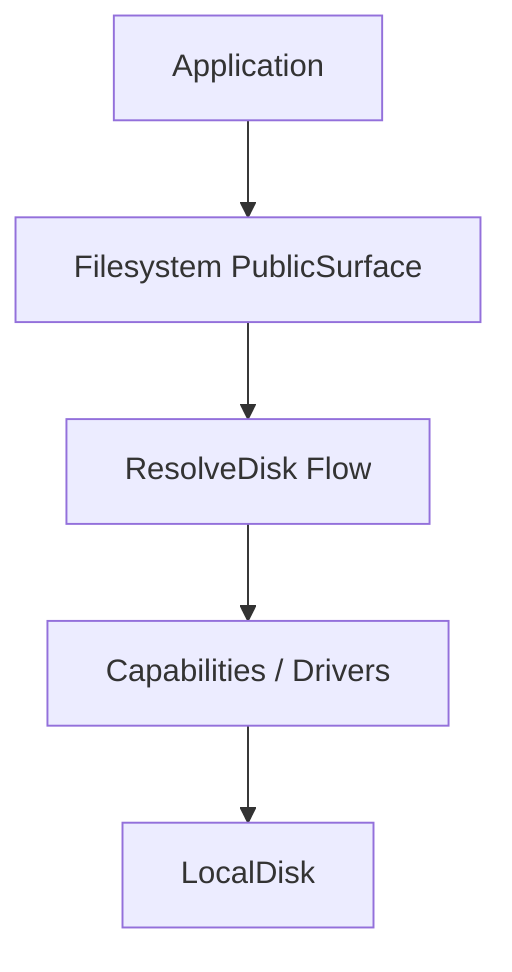

# How This Works: Filesystem Component

The Filesystem component provides an abstraction over local and remote storage systems using a disk-based driver
pattern.

## Architecture Topology

## Key Capabilities

### 1. Disk Drivers

Supports multiple "disks" defined in configuration. Each disk uses a specific driver (e.g., `LocalDisk`) to perform I/O
operations.

## Where to Debug First

1. **Permission Denied**: `Avax\Components\Application\Filesystem\System\Capabilities\Drivers`.
2. **Disk Resolution**: `Avax\Components\Application\Filesystem\System\Flows\ResolveDisk`.

## Evidence

- `components/Application/Filesystem/`
