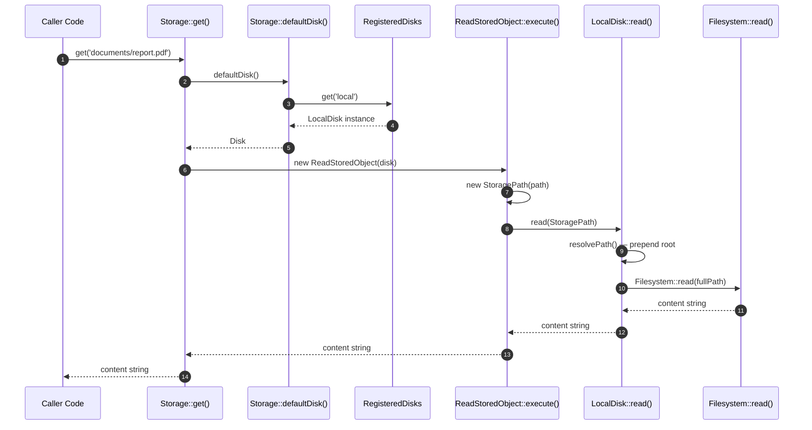
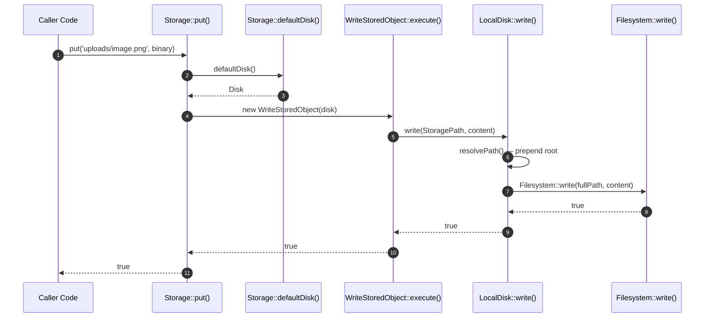

# Storage Component How This Works

## What This Component Does

This component provides a disk abstraction layer for configurable storage backends in the AvaX framework. It sits on top of the Filesystem component and introduces a pluggable disk architecture where different storage backends (local filesystem, memory, cloud services) implement a common `Disk` interface.

The `Storage` facade is a static entry point that resolves the correct disk, then delegates read/write/check/delete operations to flow classes that coordinate with the disk. This allows application code to work with storage without knowing whether data lives on disk, in memory, or in the cloud.

## What This Component Does NOT Do

- **Does not implement low-level I/O** — actual file reads and writes go through the Filesystem component. Storage orchestrates; Filesystem executes.
- **Does not provide S3, Azure, or GCS drivers yet** — only `LocalDisk` and `MemoryDisk` are implemented. Cloud adapters are planned but not built.
- **Does not handle HTTP file uploads** — upload validation, multipart parsing, and temp file management are separate concerns.
- **Does not replace the Filesystem component** — if you only need local filesystem operations without disk abstraction, use Filesystem directly.
- **Does not provide object versioning** — there is no built-in version history or soft-delete for stored objects.
- **Does not do content transformation** — image resizing, compression, and format conversion are not part of this component.

## Public API

The public surface is `Avax\Components\Application\Storage\System\PublicSurface\Storage`. It is a `final` class with static methods and an internal disk registry.

```php
use Avax\Components\Application\Storage\System\PublicSurface\Storage;
use Avax\Components\Application\Storage\System\Capabilities\Disks\LocalDisk\LocalDisk;
use Avax\Components\Application\Filesystem\System\PublicSurface\Filesystem;

// Register a disk (usually done during bootstrap)
Storage::registerDisk('local', new LocalDisk(new Filesystem(), '/var/app/storage'));
Storage::registerDisk('memory', new MemoryDisk());
Storage::setDefaultDisk('local');

// Write to the default disk
Storage::put('documents/report.pdf', $pdfContent);

// Read from the default disk
$content = Storage::get('documents/report.pdf');

// Check if an object exists
if (Storage::exists('documents/report.pdf')) {
    echo "Report exists.\n";
}

// Delete an object
Storage::delete('documents/old-report.pdf');

// Copy within the same disk
Storage::copy('documents/report.pdf', 'documents/report-backup.pdf');

// Move within the same disk
Storage::move('documents/report.pdf', 'documents/archive/report.pdf');

// Get a URL for the object
$url = Storage::url('documents/report.pdf');
// Returns "file:///var/app/storage/documents/report.pdf" for LocalDisk

// Generate a temporary URL (throws TemporaryUrlNotSupported for LocalDisk)
use DateTimeImmutable;
$expires = new DateTimeImmutable('+1 hour');
$tempUrl = Storage::temporaryUrl('documents/report.pdf', $expires);
```

### Working with Specific Disks

```php
// Get a disk directly
$s3Disk = Storage::disk('s3');

// Use the disk's interface
$content = $disk->read(new StoragePath('images/logo.png'));
$disk->write(new StoragePath('images/logo.png'), $logoContent);
```

### Method-to-Flow Mapping

| Public Method | Flow Class | What It Does |
|---------------|-----------|--------------|
| `put($path, $content)` | `WriteStoredObject` | Writes content to the default disk |
| `get($path)` | `ReadStoredObject` | Reads content from the default disk |
| `exists($path)` | `CheckStoredObject` | Checks if object exists on the default disk |
| `delete($path)` | `DeleteStoredObject` | Deletes object from the default disk |
| `copy($src, $dst)` | `CopyStoredObject` | Copies object within the default disk |
| `move($src, $dst)` | `MoveStoredObject` | Moves object within the default disk |
| `url($path)` | `GenerateStoredObjectUrl` | Generates a public URL for the object |
| `temporaryUrl($path, $expires)` | `GenerateTemporaryStoredObjectUrl` | Generates a time-limited URL |
| `disk($name)` | `ResolveDisk` (indirect) | Returns a specific disk by name |
| `defaultDisk()` | — | Returns the currently configured default disk |

## Internal Flow

### The Simplest Story

When you call `Storage::get('documents/report.pdf')`:



1. **`Storage::get()`** receives the storage path string.
2. **`Storage::defaultDisk()`** resolves the default disk (name from `$defaultDisk`, falls back to `'local'`).
3. **`Storage::disk()`** looks up the disk in the `RegisteredDisks` registry — throws `DiskNotFound` if missing.
4. **`ReadStoredObject::execute()`** wraps the path in a `StoragePath` value object and calls the disk.
5. **`LocalDisk::read()`** prepends the configured root path and delegates to `Filesystem::read()`.
6. The content string flows back through every layer to the caller.

### The First Important Path — Write to Disk

When you call `Storage::put('uploads/image.png', $binary)`:



1. **`Storage::put()`** receives the path and content.
2. **`Storage::defaultDisk()`** resolves the default disk.
3. **`WriteStoredObject::execute()`** creates a `StoragePath` and calls the disk's `write()` method.
4. **`LocalDisk::write()`** resolves the full path (root + storage path) and delegates to `Filesystem::write()`.
5. The boolean result flows back to the caller.

### Disk Registration and Resolution

Disks are registered during application bootstrap:

```php
Storage::registerDisk('local', new LocalDisk(new Filesystem(), '/var/app/storage'));
Storage::registerDisk('tmp', new LocalDisk(new Filesystem(), '/tmp'));
Storage::registerDisk('memory', new MemoryDisk());
Storage::setDefaultDisk('local');
```

The registry (`RegisteredDisks`) is a simple in-memory map keyed by `DiskName` value objects:

```php
final class RegisteredDisks
{
    private array $disks = [];

    public function register(DiskName $name, Disk $disk): void
    {
        $this->disks[$name->name] = $disk;
    }

    public function get(string $name): ?Disk
    {
        return $this->disks[$name] ?? null;
    }
}
```

If a disk is not found in the registry, `Storage::disk()` throws `DiskNotFound` with the missing disk name.

## Dependencies

| Dependency | Relationship |
|-----------|-------------|
| Filesystem component | `LocalDisk` uses `Filesystem` for all actual I/O operations |
| PHP `ext-standard` + `ext-json` | Standard library for path handling, value objects |
| `DateTimeInterface` | Used for temporary URL expiration |

The Storage component **depends on** the Filesystem component. The reverse is not true — Filesystem knows nothing about Storage.

### Disk Interface

Every disk backend implements the `Disk` interface:

```php
interface Disk
{
    public function read(StoragePath $path): string;
    public function write(StoragePath $path, string $content): bool;
    public function delete(StoragePath $path): bool;
    public function exists(StoragePath $path): bool;
    public function copy(StoragePath $source, StoragePath $destination): bool;
    public function move(StoragePath $source, StoragePath $destination): bool;
    public function url(StoragePath $path): string;
    public function temporaryUrl(StoragePath $path, DateTimeInterface $expires): string;
    public function supportsTemporaryUrl(): bool;
}
```

### Implemented Disks

| Disk | Backend | Temporary URLs | Notes |
|------|---------|---------------|-------|
| `LocalDisk` | Local filesystem via Filesystem component | No — throws `TemporaryUrlNotSupported` | Uses `file://` URLs, configurable root path |
| `MemoryDisk` | In-memory array | No — throws `TemporaryUrlNotSupported` | Useful for testing, state is per-process |

## Failure Behavior

Every failure is explicit. No silent returns, no swallowed errors.

| Exception | When Thrown | Example |
|-----------|------------|---------|
| `DiskNotFound` | Requested disk name is not in the registry | `Storage::disk('s3')` when S3 not registered |
| `StoredObjectNotFound` | Object does not exist on the disk | `$disk->read(new StoragePath('missing.txt'))` |
| `StorageOperationFailed` | Generic I/O failure on the disk | Write failed, delete failed, copy failed |
| `TemporaryUrlNotSupported` | Temporary URL requested on a disk that does not support it | `Storage::temporaryUrl(...)` on LocalDisk |
| `InvalidStoragePath` | Path fails validation (empty, contains traversal, etc.) | `$path = new StoragePath('')` |

### DiskNotFound

```php
final class DiskNotFound extends RuntimeException
{
    public function __construct(
        public readonly string $diskName,
    ) {
        parent::__construct("Disk not found: {$diskName}");
    }
}
```

### TemporaryUrlNotSupported

```php
final class TemporaryUrlNotSupported extends RuntimeException
{
    public function __construct(
        public readonly string $diskName,
    ) {
        parent::__construct("Temporary URLs are not supported for disk: {$diskName}");
    }
}
```

Local disk and memory disk both throw this. Cloud backends (S3, etc.) would implement `temporaryUrl()` with signed URLs.

## Runtime Safety

### Path Validation

Storage paths are wrapped in `StoragePath` value objects, which validate the path on construction:

```php
final class StoragePath
{
    public function __construct(
        public readonly string $path,
    ) {
        if ($path === '' || $path === '/') {
            throw new InvalidStoragePath($path);
        }
    }
}
```

The `RejectUnsafeStoragePath` capability provides additional checks:
- Blocks empty paths and root-only paths.
- Blocks path traversal patterns (`..`).
- Normalizes separators.

### Root Path Isolation

`LocalDisk` isolates operations to its configured root directory. The root is prepended to every path, so even if application code passes `../../etc/passwd`, the resolved path stays within the disk's root:

```php
$disk = new LocalDisk(new Filesystem(), '/var/app/storage');

// Resolves to /var/app/storage/uploads/file.txt
$disk->read(new StoragePath('uploads/file.txt'));

// Resolves to /var/app/storage/etc/passwd (still inside root)
// The .. segments are handled by the Filesystem's RejectPathTraversal
$disk->read(new StoragePath('../../etc/passwd'));
```

### Disk Registry Safety

The disk registry is static and process-scoped. Once a disk is registered, it cannot be unregistered or replaced. This prevents accidental mid-request disk swaps:

```php
Storage::registerDisk('local', $localDisk);  // OK
Storage::registerDisk('local', $otherDisk);  // Overwrites — be careful
```

**Note:** The current implementation allows re-registration. A future hardening pass should make registration idempotent or throw on duplicate.

## Examples

### Bootstrap Configuration

```php
use Avax\Components\Application\Storage\System\Configuration\StorageConfiguration;
use Avax\Components\Application\Storage\System\PublicSurface\Storage;
use Avax\Components\Application\Storage\System\Capabilities\Disks\LocalDisk\LocalDisk;
use Avax\Components\Application\Filesystem\System\PublicSurface\Filesystem;

$config = StorageConfiguration::fromArray([
    'default' => 'local',
    'disks' => [
        'local' => ['driver' => 'local', 'root' => '/var/app/storage'],
        'public' => ['driver' => 'local', 'root' => '/var/www/public/storage'],
    ],
]);

$fs = new Filesystem();

foreach ($config->disks as $name => $diskConfig) {
    Storage::registerDisk($name, new LocalDisk($fs, $diskConfig['root']));
}

Storage::setDefaultDisk($config->defaultDisk);
```

### User File Upload Storage

```php
// Store an uploaded file
$userId = 42;
$filename = 'avatar.png';
$path = "users/{$userId}/{$filename}";

Storage::put($path, $uploadedFileContent);

// Check it was stored
if (Storage::exists($path)) {
    $url = Storage::url($path);
    echo "Avatar URL: {$url}";
}

// Later: delete the avatar
Storage::delete($path);
```

### Multi-Disk Strategy

```php
// Default disk for user content
Storage::put('reports/monthly.pdf', $reportPdf);

// Public disk for accessible assets
$publicDisk = Storage::disk('public');
$publicDisk->write(new StoragePath('css/app.css'), $cssContent);

// Memory disk for testing
$memoryDisk = Storage::disk('memory');
$memoryDisk->write(new StoragePath('test.txt'), 'test data');
$content = $memoryDisk->read(new StoragePath('test.txt'));
```

### Handling Missing Disk

```php
use Avax\Components\Application\Storage\System\PublicSurface\Storage;
use Avax\Components\Application\Storage\System\Foundation\Failure\DiskNotFound;

try {
    $s3 = Storage::disk('s3');
    $s3->write(new StoragePath('backup.zip'), $data);
} catch (DiskNotFound $e) {
    // Disk not registered — log and use fallback
    error_log("S3 disk not available: {$e->diskName}");
    Storage::put('backup.zip', $data);  // falls back to local
}
```

## Known Limits

| Limit | Detail |
|-------|--------|
| **Only LocalDisk and MemoryDisk implemented** | Cloud backends (S3, Azure Blob, GCS, FTP, etc.) are not yet built. The `Disk` interface is ready for them, but the implementations are missing. |
| **No cross-disk operations** | `copy` and `move` work within a single disk. Copying from `local` to `s3` (when S3 exists) is not supported by the current flow API. |
| **No streaming** | `put()` and `get()` load entire content into memory. For large files (hundreds of MB+), use the Filesystem component directly with PHP streams. |
| **No metadata support** | There is no storage or retrieval of object metadata (content-type, size, ETag, custom headers). The `StoredObjectMetadata` value object exists but is not yet wired into flows. |
| **No directory operations on disks** | Disks do not have `listDirectory`, `createDirectory`, or `deleteDirectory` methods. Directory operations go through the Filesystem component directly. |
| **Static registry** | The disk registry is a static singleton. This makes testing with isolated registries difficult — each test must be careful not to pollute global state. |
| **No retry or resilience** | There is no built-in retry logic, circuit breaker, or fallback when a disk operation fails transiently. |
| **`supportsTemporaryUrl()` is not capability-based** | Callers must check `supportsTemporaryUrl()` before calling `temporaryUrl()` to avoid exceptions. A capability-returning `null` would be cleaner. |

## Current Status

**YELLOW**

| Criterion | Status |
|-----------|--------|
| Public API defined | GREEN — `Storage` facade with 10 static methods + `Disk` interface with 9 methods |
| Disk interface + registry | GREEN — `Disk` interface, `RegisteredDisks`, `ResolveDisk`, `RegisterDisk` |
| LocalDisk implementation | GREEN — full implementation using Filesystem component |
| MemoryDisk implementation | GREEN — in-memory array backend for testing |
| Flow-driven architecture | GREEN — `WriteStoredObject`, `ReadStoredObject`, `CheckStoredObject`, `DeleteStoredObject`, `CopyStoredObject`, `MoveStoredObject`, `GenerateStoredObjectUrl`, `GenerateTemporaryStoredObjectUrl` |
| Path safety capabilities | GREEN — `NormalizeStoragePath`, `RejectUnsafeStoragePath` |
| Visibility capabilities | GREEN — `ObjectVisibility`, `ResolveObjectVisibility` |
| Specific exception types | GREEN — `DiskNotFound`, `StoredObjectNotFound`, `StorageOperationFailed`, `TemporaryUrlNotSupported`, `InvalidStoragePath` |
| Value objects | GREEN — `DiskName`, `StoragePath`, `StoredObject`, `StoredObjectMetadata` |
| Configuration | GREEN — `StorageConfiguration`, `RegisterStorageDisks` |
| Tests | GREEN — 169 tests in `tests/Unit/Components/Application/Storage/` |
| S3 / cloud disk drivers | RED — not implemented yet; interface is ready |
| Cross-disk operations | RED — not supported |
| Streaming support | RED — not supported |
| Documentation | RED — no long-form documentation in `docs/` yet |

The component is structurally sound with a clean interface and solid test coverage. The main gaps are additional disk drivers (cloud backends) and canonical documentation in `docs/`.
