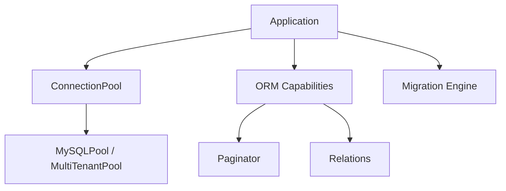

# How This Works: DataStack Component

The DataStack handles all interactions with the database, including connection pooling, migrations, and ORM operations.

## Architecture Topology

## Key Capabilities

### 1. Connection Pooling

Managed via `ConnectionPoolInterface`. It supports:

- `MySQLPool`: For single-database apps.
- `MultiTenantPool`: For SaaS/Multi-tenant apps.

### 2. Migration Engine

Skenira `migrations/` folder, proverava `migrations` tabelu u bazi i izvršava nedostajuće skripte u batch-evima.

## Where to Debug First

1. **Connection Issues**: `Avax\Components\DataStack\Database\System\Capabilities\Connections`.
2. **Migration Failures**: `Avax\Components\DataStack\Database\System\Capabilities\Migrations`.
3. **ORM Logic**: `Avax\Components\DataStack\Database\System\Capabilities\ORM`.

## Evidence

- `components/DataStack/Database/`
