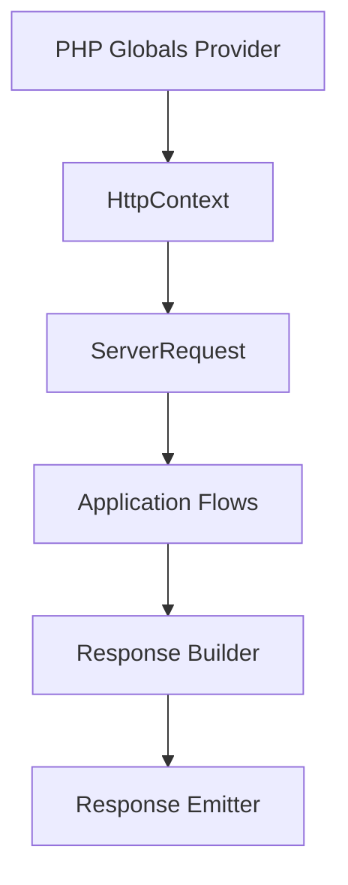

# How This Works: HTTP Component

The HTTP component handles the entire lifecycle of an incoming request, from global PHP state to a structured response.

## Architecture Topology

## Key Flows

### 1. Request Resolution

The system parses `$_SERVER`, `$_GET`, `$_POST`, etc., into a read-only `HttpContext`. This is then wrapped in a
PSR-compatible (or optimized) `ServerRequest` object.

### 2. Session Management

Sessions are handled via `Session` PublicSurface, which delegates to:

- `ReadSessionValue` flow
- `StoreSessionValue` flow
- `NativeSessionStore` (Capability)

## Where to Debug First

1. **Request Data**: Check `Avax\Components\HTTP\Context\System\PublicSurface\HttpContext`.
2. **Routing**: Check `Avax\Components\Router\System\Flows\ResolveRequest`.
3. **Session Issues**: Check `Avax\Components\HTTP\Session\System\Capabilities\Storage`.

## Evidence

- `components/HTTP/Context/`
- `components/HTTP/Session/`
- `components/HTTP/Security/`
