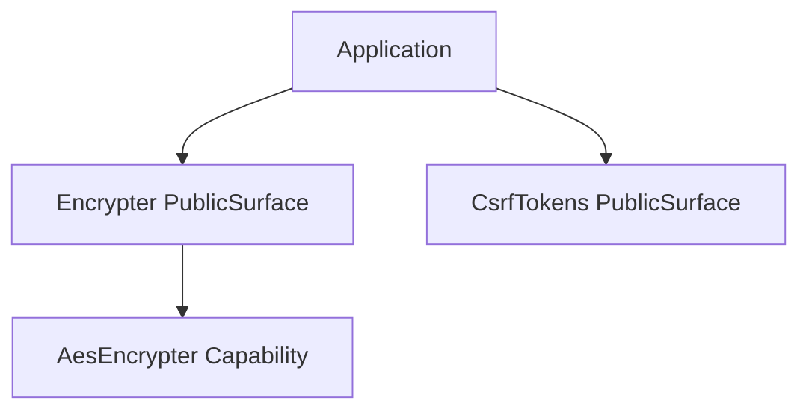

# How This Works: Identity Security Component

This component manages sensitive operations like data encryption and CSRF protection.

## Architecture Topology

## Key Capabilities

### 1. AES Encryption

Uses `aes-256-cbc` with random IVs to encrypt mixed PHP values. All data is serialized before encryption and
unserialized upon decryption.

## Where to Debug First

1. **Decryption Failures**: Check encryption keys in `.env`.
2. **CSRF Mismatch**: `Avax\Components\HTTP\Security\System\Capabilities\Csrf`.

## Evidence

- `components/Identity/Security/`
- `components/HTTP/Security/`
