# Login Flow

## Overview

The login flow is the complete sequence from credential submission to authenticated session/token issuance. It encompasses credential collection, verification, optional MFA, identity production, and session/token creation.

## Sequence Diagram

```mermaid
sequenceDiagram
    participant Client
    participant PublicSurface
    participant LoginFlow
    participant AuthCapability
    participant CredentialValidator
    participant MFACapability
    participant IdentityProducer
    participant SessionCapability
    participant TokenCapability
    participant Observability

    Client->>PublicSurface: POST /login (credentials)
    PublicSurface->>LoginFlow: authenticate(credentials)

    LoginFlow->>Observability: event: login_attempt_started

    LoginFlow->>AuthCapability: verifyCredentials(credentials)
    AuthCapability->>CredentialValidator: validate(credentials)

    alt Valid Credentials
        CredentialValidator-->>AuthCapability: verified = true
        AuthCapability-->>LoginFlow: verifiedIdentity

        alt MFA Required
            LoginFlow->>MFACapability: challenge(identity)
            MFACapability->>Client: MFA challenge request
            Client->>PublicSurface: MFA response
            PublicSurface->>LoginFlow: completeMFA(response)
            LoginFlow->>MFACapability: verifyMFA(response, identity)

            alt MFA Verified
                MFACapability-->>LoginFlow: mfaVerified = true
            else MFA Failed
                MFACapability-->>LoginFlow: mfaVerified = false
                LoginFlow->>Observability: event: login_failed(mfa)
                LoginFlow-->>PublicSurface: authenticationFailed
                PublicSurface-->>Client: 401 Unauthorized
            end
        end

        LoginFlow->>IdentityProducer: produceIdentity(verifiedIdentity)
        IdentityProducer-->>LoginFlow: identityClaims

        LoginFlow->>SessionCapability: createSession(identityClaims)
        SessionCapability-->>LoginFlow: sessionId

        LoginFlow->>TokenCapability: issueTokens(identityClaims, sessionId)
        TokenCapability-->>LoginFlow: accessToken, refreshToken

        LoginFlow->>Observability: event: login_succeeded
        LoginFlow-->>PublicSurface: authenticationResult(tokens, session)
        PublicSurface-->>Client: 200 OK (tokens)

    else Invalid Credentials
        CredentialValidator-->>AuthCapability: verified = false
        AuthCapability-->>LoginFlow: verificationFailed
        LoginFlow->>Observability: event: login_failed(invalid_credentials)
        LoginFlow-->>PublicSurface: authenticationFailed
        PublicSurface-->>Client: 401 Unauthorized
    end
```

## Steps

1. **Credential Submission**: Client submits credentials to the login endpoint
2. **Credential Verification**: The authentication capability delegates to the appropriate credential validator
3. **MFA Challenge** (conditional): If MFA is required by policy, the MFA capability issues and verifies a challenge
4. **Identity Production**: Verified credentials produce a unified identity claim set
5. **Session Creation**: A new server-side session is created and bound to the identity
6. **Token Issuance**: Access and refresh tokens are issued, bound to the identity and session
7. **Response**: Tokens and session information are returned to the client

## Failure Modes

- Invalid credentials: 401 with generic error message (no information leakage)
- MFA failure: 401 with generic error message
- Session creation failure: 500 with observability event
- Token issuance failure: 500 with observability event
- Any uncertainty: fail closed, deny access

## Security Considerations

- Generic error messages prevent credential enumeration
- MFA is triggered by policy, not client request
- All steps produce observable events
- Credentials are never logged or echoed
- Session and token are bound to the verified identity
