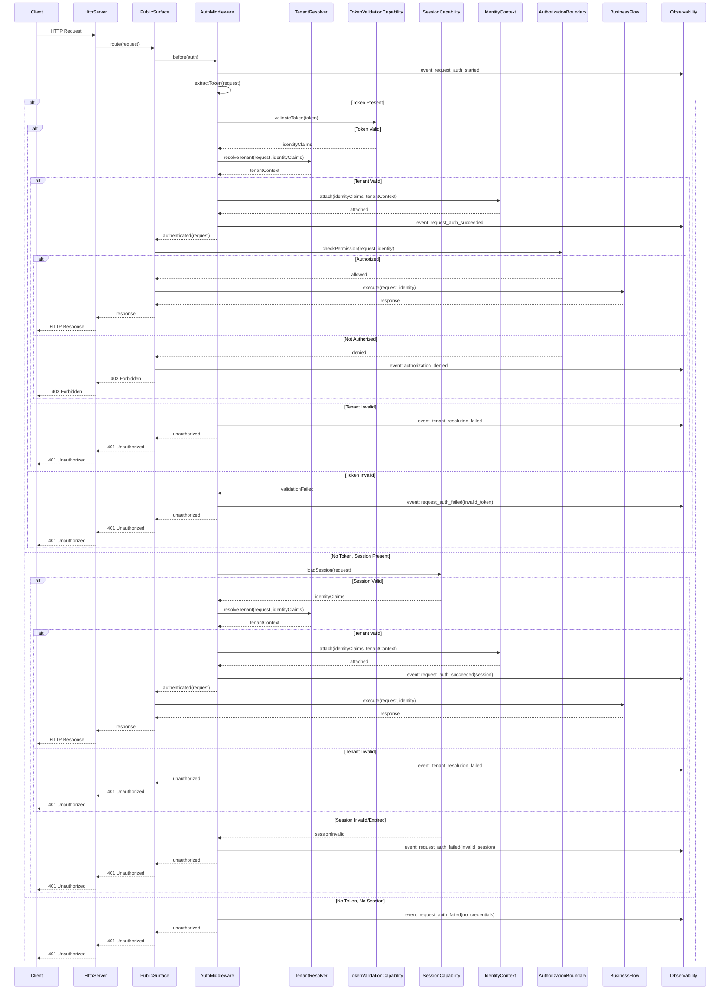

# Request Authentication Lifecycle

## Overview

The request authentication lifecycle describes how every incoming request is authenticated, from initial receipt through identity attachment and downstream authorization readiness.

## Sequence Diagram

## Lifecycle Stages

1. **Request Receipt**: HTTP server receives the request
2. **Credential Extraction**: Auth middleware extracts token or session identifier
3. **Token/Session Validation**: The appropriate validation capability verifies the credential
4. **Tenant Resolution**: Tenant context is resolved and validated against identity
5. **Identity Attachment**: Verified identity and tenant context are attached to the request
6. **Authorization Check**: Authorization boundary checks permissions for the requested operation
7. **Business Execution**: If authorized, the business flow executes with the attached identity

## Failure Modes

- No credentials: 401, request denied
- Invalid token: 401, request denied
- Invalid session: 401, request denied
- Invalid tenant: 401, request denied
- Insufficient permissions: 403, request denied
- Any validation error: fail closed, deny access

## Security Considerations

- Authentication runs before any business logic
- Tenant resolution is validated before data access
- Authorization protects the resource, not only the route
- All stages produce observable events
- No identity state persists between requests in long-lived workers
