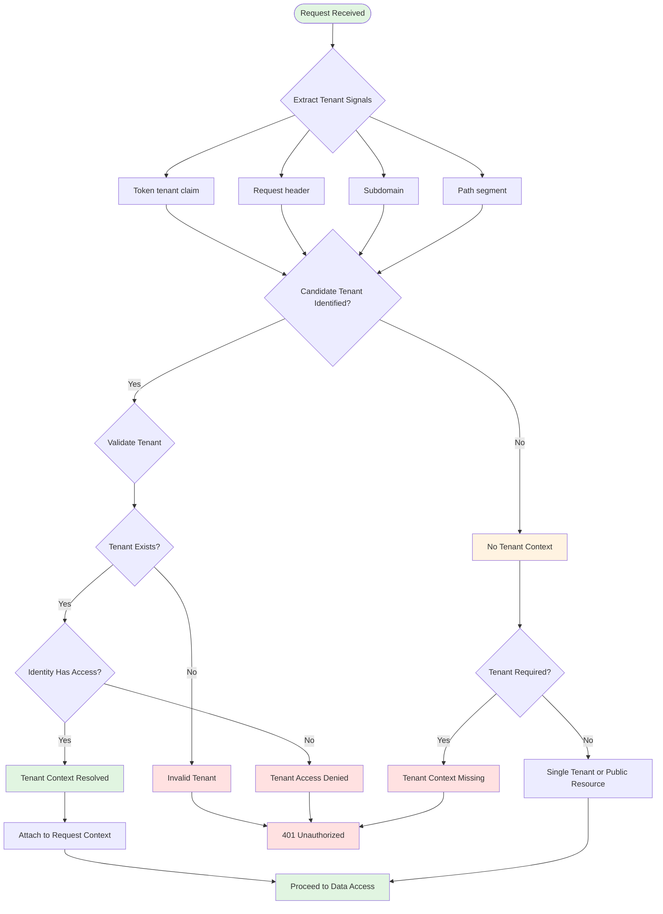

# Tenant Resolution Lifecycle

## Overview

The tenant resolution lifecycle determines which tenant context applies to each request. Tenant context must be resolved before any data access occurs, and must be validated against the authenticated identity.

## Flowchart

## Resolution Strategy

Tenant context may be resolved from multiple signals, evaluated in priority order:

1. **Token Claim**: If the access token contains a tenant claim, use it (highest confidence)
2. **Request Header**: Explicit tenant identifier in a request header (e.g., `X-Tenant-ID`)
3. **Subdomain**: Tenant identifier extracted from the request subdomain
4. **Path Segment**: Tenant identifier from the URL path

## Validation Steps

1. **Identify**: Extract tenant identifier from the highest-priority available signal
2. **Exist**: Verify the tenant exists in the system
3. **Access**: Verify the authenticated identity has access to this tenant
4. **Attach**: Bind the tenant context to the request for downstream use

## Failure Modes

- No tenant signal on a tenant-required request: 401
- Tenant does not exist: 401
- Identity lacks access to resolved tenant: 401
- Multiple conflicting tenant signals: fail closed, 401

## Security Considerations

- Tenant context must be validated before any data access
- Identity must have explicit access to the resolved tenant
- Conflicting signals indicate a potential attack and must fail closed
- Tenant resolution produces observable events for security monitoring
- Tenant context is per-request, not per-session
