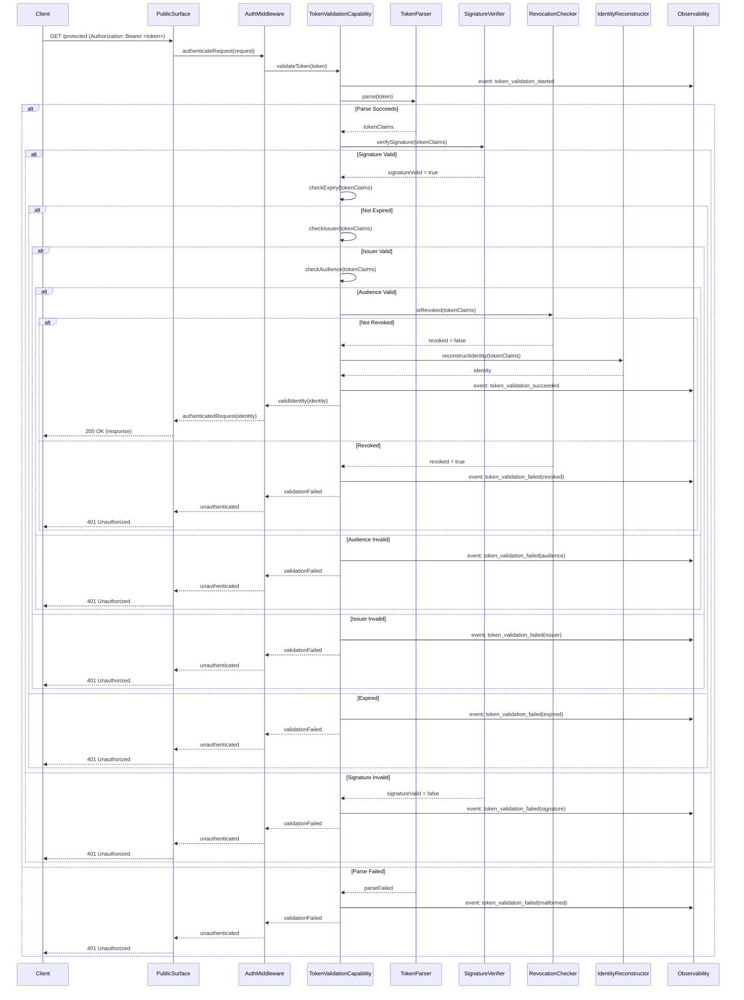

# Token Validation Flow

## Overview

The token validation flow verifies that a presented token is authentic, unexpired, and authorized for the requested operation. This flow runs on every authenticated request.

## Sequence Diagram

## Validation Steps

1. **Parse**: Extract and decode the token structure
2. **Signature**: Verify the cryptographic signature
3. **Expiry**: Check the token has not expired
4. **Issuer**: Verify the token was issued by a trusted issuer
5. **Audience**: Verify the token is intended for this audience
6. **Revocation**: Check if the token has been revoked
7. **Identity Reconstruction**: Rebuild the identity claim set from valid token claims

## Failure Modes

- Malformed token: 401, event logged
- Invalid signature: 401, event logged
- Expired token: 401, event logged (client should refresh)
- Invalid issuer: 401, event logged (possible token injection)
- Invalid audience: 401, event logged (possible token misuse)
- Revoked token: 401, event logged (possible compromise)

## Security Considerations

- Every validation step must pass; any failure denies access
- Validation produces observable events for security monitoring
- Generic error messages prevent information leakage
- Validation is stateless for access tokens (except revocation check)
- No caching of validation results between requests in long-lived workers
