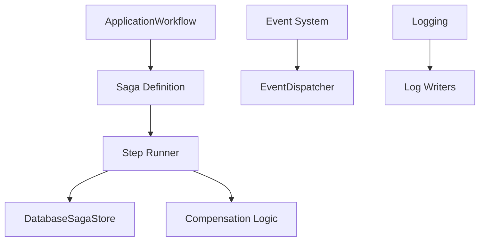

# How This Works: Operations Component

The Operations component owns the cross-cutting mechanisms that drive the application's behavior beyond simple data or
HTTP cycles.

## Architecture Topology

## Key Features

### 1. Saga Workflow

Omogućava izvršavanje kompleksnih procesa u više koraka sa atomičnošću. Ako jedan korak padne, izvršavaju se
`compensation` akcije za sve prethodno uspešne korake u obrnutom redosledu.

### 2. Event System

Pub/Sub mehanizam koji podržava prioritete listener-a i zaustavljanje propagacije.

## Where to Debug First

1. **Saga State**: Proveri `sagas` tabelu u bazi.
2. **Event Dispatching**: `Avax\Components\Operations\Events\System\Capabilities`.
3. **Log Outputs**: Proveri `storage/logs`.

## Evidence

- `components/Operations/ApplicationWorkflow/`
- `components/Operations/Events/`
- `components/Operations/Logging/`
