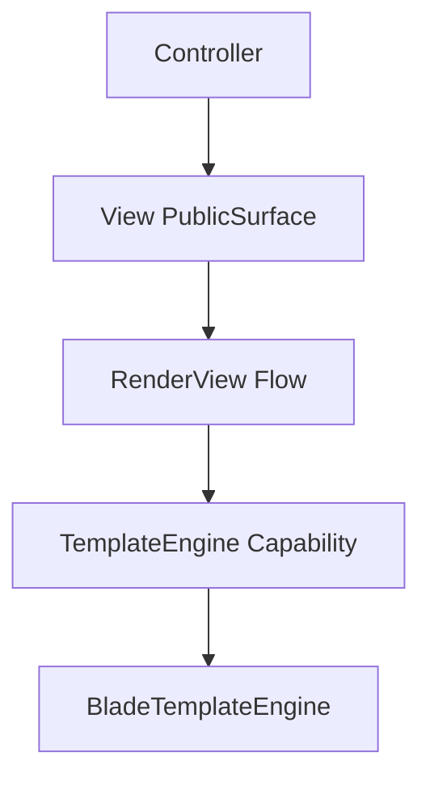

# How This Works: View Component

The View component manages the rendering of templates using various engines (primarily Blade).

## Architecture Topology

## Key Flows

### 1. Render View

The `RenderView` flow takes a view name and data, identifies the correct template file, and uses the
`BladeTemplateEngine` to produce HTML.

## Where to Debug First

1. **Template Not Found**: `Avax\Components\Presentation\View\System\Flows\RenderView`.
2. **Blade Errors**: `Avax\Components\Presentation\View\System\Capabilities\Engines`.

## Evidence

- `components/Presentation/View/`
