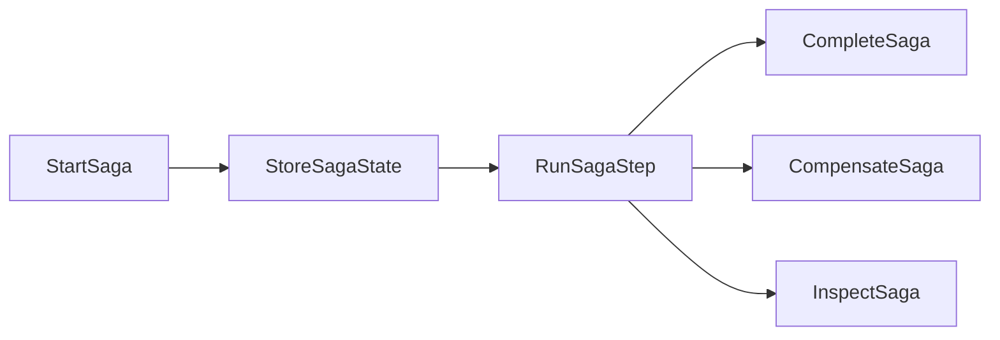

# Saga Review

## ARCHITECTURE NOTES

System type: framework workflow component.
Primary consumers: application workflows that need long-running consistency.
Runtime context: mixed HTTP, CLI, worker, and tests.
Lifecycle: new workflow skeleton beside DataLayer and Database.

This system is fundamentally organized around **long-running workflow state transition**.
Secondary axis: **compensation and recovery**, justified because failures across systems cannot be modeled as database
rollback.

This is how the system actually works: `StartSaga` validates a definition, creates state, records a start event, and
schedules the first step. `RunSagaStep` loads state, runs the current step, records success or failure, and stores the
next state. Completion, compensation, resume, idempotency, and inspection are separate ownership folders.

## FINDINGS

### Finding: Saga boundary is separate from data concerns

- **Symptom:** Saga state, compensation, idempotency, and recovery live under `Foundation/ApplicationWorkflow/Saga`.
- **Root Cause:** Saga is an application workflow consistency pattern, not a database component.
- **Impact:** DataLayer can provide transactions/outbox later without owning business workflow semantics.
- **Evidence:** `Foundation/ApplicationWorkflow/Saga/*`, `Foundation/DataLayer/PropagateDataChanges`,
  `Foundation/DataLayer/CommitDataChanges`.
- **Risk Level:** Low

### Finding: Runtime integrations are intentionally in-memory

- **Symptom:** Store and idempotency use in-memory structures in this milestone.
- **Root Cause:** The first milestone locks shape and behavior before adding persistence adapters.
- **Impact:** Cross-process recovery still needs a DataLayer-backed store before production use.
- **Evidence:** `StoreSagaState.php`, `ProtectSagaIdempotency.php`, `Saga::inMemory()`.
- **Risk Level:** Medium

## DECISION

Keep and Improve. The component has the right axis and correctly stays outside DataLayer. The next step is to add
persistent store, message bus, retry, and compensation implementations through explicit folders rather than generic
handlers or processors.

## DECISIONS-LOG

- 2026-04-24: Saga belongs to `Foundation/ApplicationWorkflow/Saga`.
- 2026-04-24: Saga may use DataLayer transaction/outbox boundaries later, but does not own them.
- 2026-04-24: Empty interfaces were not created because no real consumer needs them in this milestone.

## NEXT STEPS

- Implement a DataLayer-backed `StoreSagaState` adapter.
- Add reverse-order compensation execution tests.
- Add recoverable/unrecoverable state transitions.
- Add idempotent retry policy for command and step execution.
- Add message publication through DataLayer outbox.