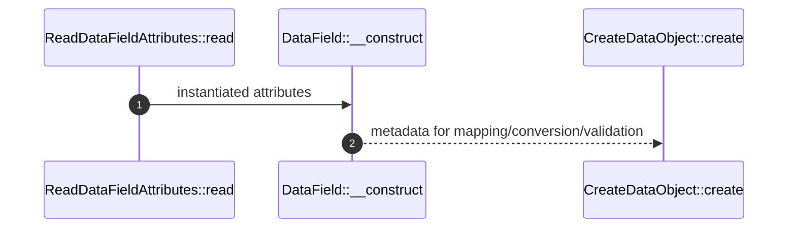

# Attributes How This Works

## What this folder is

This folder owns the small metadata DSL used by the data transfer runtime.

## Real commands or triggers that reach this folder

- Reflection through `ReadDataFieldAttributes::read(...)`

## Exact upstream handoffs

- `ReadConstructorDataFields::read(...)`
- `ReadPublicDataFields::read(...)`

## The simplest story

- `MapFrom` changes the input key.
- `ListOf` declares array item data object type.
- `CastWith` delegates conversion.
- `Hidden` removes output fields.
- `Optional`, `Required`, and `DefaultValue` tune missing-field behavior.

## The first important path

