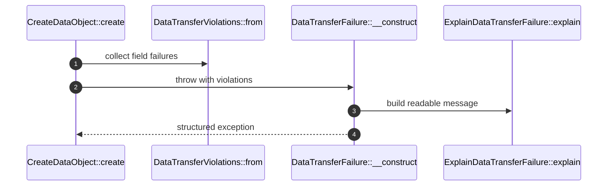

# ErrorReporting How This Works

## What this folder is

This folder owns structured failure data for data transfer operations.

## Real commands or triggers that reach this folder

- Unknown fields in `MatchInputToDataShape`
- Conversion failures in `ValueConversion`
- Validation failures in `FieldValidation`
- Instantiation failures in `InstantiateDataObject`

## Exact upstream handoffs

- `DataTransferFailure::__construct(...)`
- `DataTransferViolations::from(...)`
- `ExplainDataTransferFailure::explain(...)`

## The simplest story

- Every failure can carry many `DataTransferViolation` objects.
- Each violation has a machine code, path, human message, expected type, actual type, failed rule, and previous
  exception.
- Exception text is only a readable summary.
- Runtime callers should inspect `violations()` for source-of-truth diagnostics.

## The first important path

## Compatibility

`DTOValidationException` keeps the old `getErrors()` API by converting structured violations into the legacy associative
array format.
