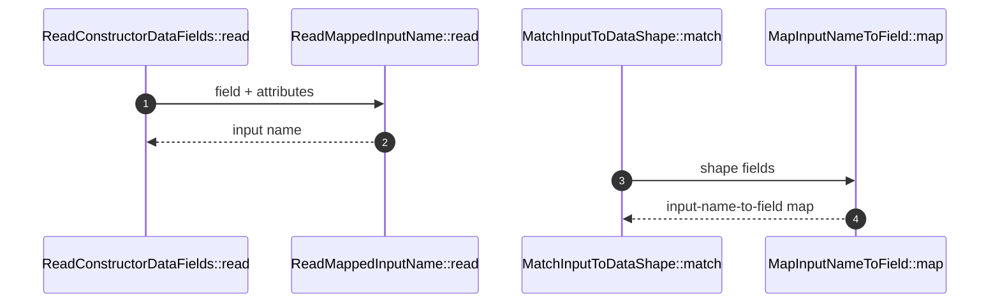

# FieldMapping How This Works

## What this folder is

This folder owns the relationship between external input names and internal data field names.

## Real commands or triggers that reach this folder

- Shape inspection through `ReadConstructorDataFields::read(...)`
- Input matching through `MatchInputToDataShape::match(...)`

## Exact upstream handoffs

- `ReadMappedInputName::read(...)`
- `MapInputNameToField::map(...)`

## The simplest story

- `MapFrom` provides an explicit external input name.
- If there is no `MapFrom`, `DataTransferConfig::inputNameFor(...)` applies the configured naming policy.
- If there is no policy, the field name is the input name.

## The first important path

## Debug first

If a field is missing even though the input contains data, check `MapFrom` and the configured naming policy first.
