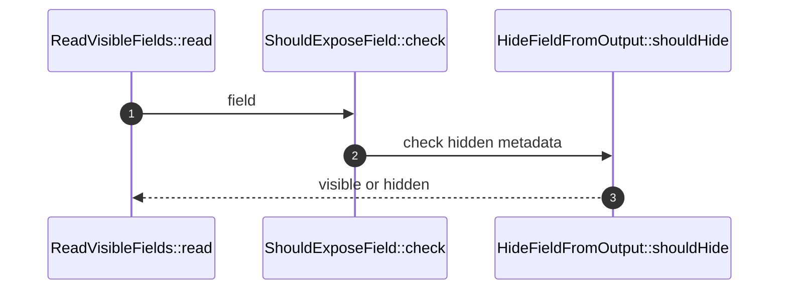

# FieldVisibility How This Works

## What this folder is

This folder owns the decision about whether a field is exposed in serialized output.

## Real commands or triggers that reach this folder

- `ReadVisibleDataFields::read(...)`

## Exact upstream handoffs

- `ReadDataObject::values(...)` -> `ReadVisibleFields::read(...)`

## The simplest story

- Fields are visible by default.
- `Hidden` attributes opt fields out.
- Callers can disable hidden filtering for debugging or legacy flat output.

## The first important path

