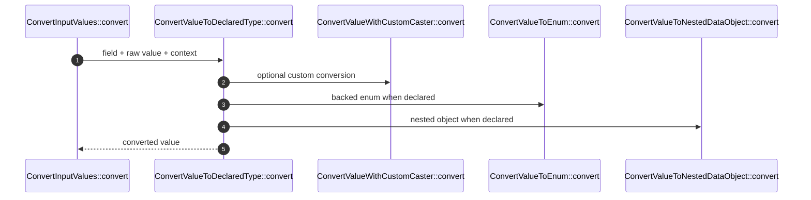

# ValueConversion How This Works

## What this folder is

This folder owns value coercion for one field at a time. It does not know the whole DTO flow.

## Real commands or triggers that reach this folder

- `ConvertInputValues::convert(...)`

## Exact upstream handoffs

- `CreateDataObject::create(...)` -> `ConvertInputValues::convert(...)` -> `ConvertValueToDeclaredType::convert(...)`

## The simplest story

- Custom caster wins first.
- Arrays can become lists of nested data objects through `ListOf`.
- Backed enums are resolved through `tryFrom`.
- Scalar conversion is strict enough to reject unclear values.
- Nested objects recurse through `CreateDataObject`.

## The first important path

## Failure shape

Conversion failures use `ValueConversionFailed` and include field path, expected type, actual type, and the previous
exception when one exists.
