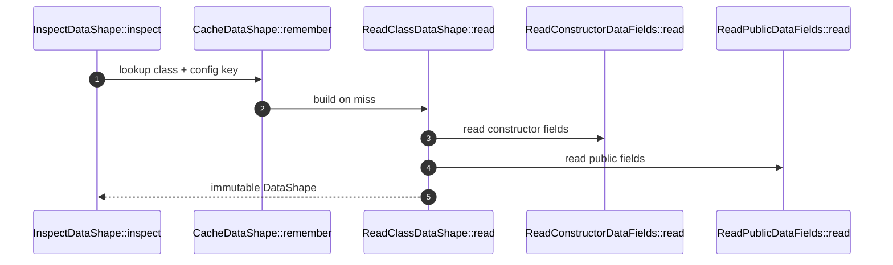

# InspectDataShape How This Works

## What this folder is

This folder turns PHP reflection into immutable `DataShape`, `DataField`, and `DataFieldType` models.

## Real commands or triggers that reach this folder

- `DataTransfer::inspect(...)`
- `CreateDataObject::create(...)`
- `SerializeDataObject::toArray(...)`

## Exact upstream handoffs

- `ReadTargetDataShape::read(...)`
- `ReadDataObject::values(...)`

## The simplest story

- Constructor parameters are read first because native constructor DTOs are the target design.
- Public properties are added only as compatibility/public-property fields.
- Attributes are instantiated once into field metadata.
- `CacheDataShape` keeps reflection out of the hot path.

## The first important path

## Debug first

If mapping or serialization sees the wrong field, inspect `ReadConstructorDataFields` and `ReadPublicDataFields` before
debugging conversion.
