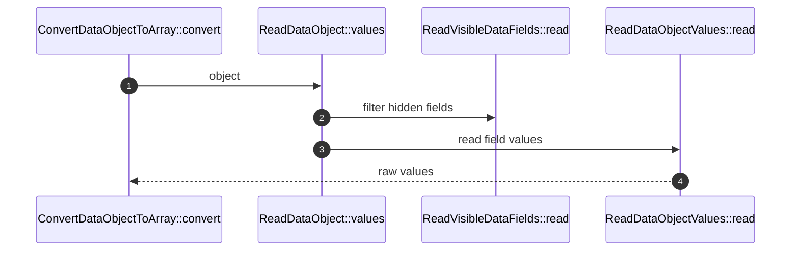

# ReadDataObject How This Works

## What this folder is

This folder owns reading values from an existing data object before output normalization.

## Real commands or triggers that reach this folder

- `SerializeDataObject::toArray(...)`

## Exact upstream handoffs

- `ConvertDataObjectToArray::convert(...)` -> `ReadDataObject::values(...)`

## The simplest story

- Inspect the object's shape.
- Filter fields through field visibility.
- Read initialized public/promoted values.
- Hand raw values to normalization.

## The first important path

