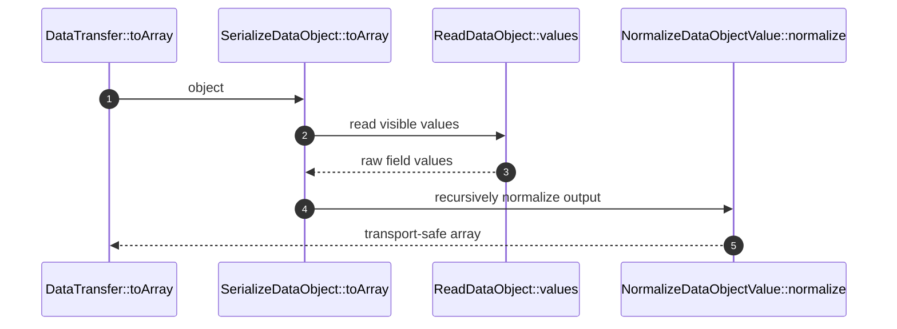

# SerializeDataObject How This Works

## What this folder is

This folder owns output conversion from data objects to arrays, JSON, flat arrays, `stdClass`, and JSON:API documents.

## Real commands or triggers that reach this folder

- `DataTransfer::toArray(...)`
- `DataTransfer::toJson(...)`
- Legacy DTO methods such as `AbstractDTO::toArray()`

## Exact upstream handoffs

- `DataTransfer::toArray(...)`
- `SerializeLegacyDTO::toArray(...)`

## The simplest story

- `ReadDataObject` reads visible fields from the inspected shape.
- `NormalizeDataObjectValue` recursively normalizes enums, dates, nested objects, traversables, and arrays.
- Hidden fields are removed before normalization.
- JSON encoding uses `JSON_THROW_ON_ERROR`.

## The first important path

## Failure shape

Circular references normalize to `null` once an object has already been seen. Depth limits also return `null` after the
configured maximum.
