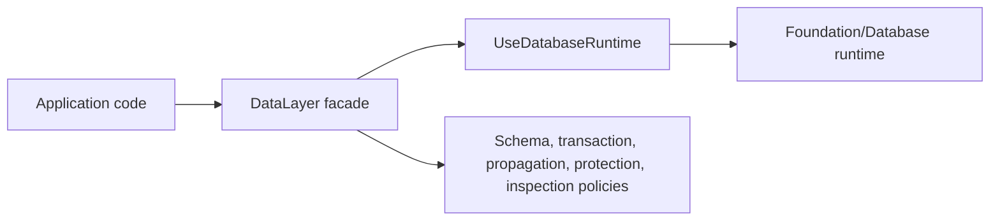

# DataLayer Review

## ARCHITECTURE NOTES

System type: framework foundation component.
Primary consumers: application layer and future workflow/data policy code.
Runtime context: mixed HTTP, CLI, worker, and tests.
Lifecycle: new architecture skeleton beside an existing Database runtime.

This system is fundamentally organized around **data access and data correctness boundary**.
Secondary axis: **data operations and governance**, justified because operational data rules affect schema, propagation,
security, and inspection decisions.

This is how the system actually works: callers compose `DataLayer` with an explicit database runtime.
`ConfigureDataLayer` validates that runtime before any capability is exposed. `AccessPersistentData` is the only slice
that receives `UseDatabaseRuntime`; other slices describe policy and boundaries without copying Database internals.

## FINDINGS

### Finding: Database remains the concrete runtime

- **Symptom:** Existing `Foundation/Database` owns connections, query builder, migrations, ORM, transactions, and
  telemetry.
- **Root Cause:** DataLayer is a higher-level ownership boundary, not a replacement runtime.
- **Impact:** Moving Database files now would create duplicate ownership and break a stable runtime surface.
- **Evidence:** `Foundation/Database/Database.php`, `Foundation/Database/Query.php`,
  `Foundation/Database/Transactions.php`, `Foundation/Database/System/Capabilities/*`.
- **Risk Level:** Low

### Finding: Missing capabilities are intentionally skeletal

- **Symptom:** CDC/outbox, data governance, distribution, cache invalidation, and operational health exist as named
  owner files but not full storage integrations yet.
- **Root Cause:** The first milestone locks architecture before implementation depth.
- **Impact:** Future work has a clear place to grow without creating generic service folders.
- **Evidence:** `Foundation/DataLayer/PropagateDataChanges`, `ProtectStoredData`, `DistributeStoredData`,
  `OperateDataLayer`.
- **Risk Level:** Medium

## DECISION

Keep and Improve. The component has the right boundary: DataLayer owns data concerns and delegates concrete database
work to Foundation/Database through an explicit handoff. It should evolve capability by capability, starting with raw
query adapter execution, transaction policy tests, outbox persistence, tenant boundary enforcement, and diagnostics-safe
inspection.

## DECISIONS-LOG

- 2026-04-24: DataLayer is an umbrella for data architecture and policy, not a replacement for Foundation/Database.
- 2026-04-24: Saga remains outside DataLayer because workflow compensation and recovery are application workflow
  concerns.
- 2026-04-24: Empty interfaces were not created because no real consumer needs them in this milestone.

## NEXT STEPS

- Add a concrete adapter that maps `PersistentDataRequest` to the existing Database query runtime.
- Expand `EvolveStoredSchema` with destructive migration detection.
- Implement outbox storage and deduplication under `PropagateDataChanges`.
- Implement tenant boundary and masking rules under `ProtectStoredData`.
- Add cross-component tests once Saga uses DataLayer transaction and outbox boundaries.