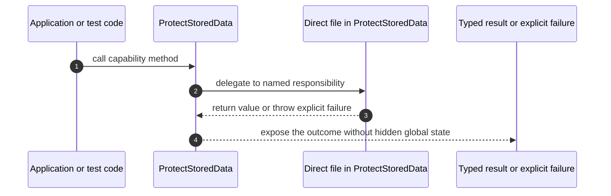

# ProtectStoredData How This Works

## What this folder is

`Foundation/DataLayer/ProtectStoredData` is the ownership chapter for `Avax\DataLayer\ProtectStoredData`. It exists so
the codebase can name this capability directly instead of hiding it behind a service, manager, helper, or generic
runtime bucket.

## Real commands or triggers that reach this folder

- Application code composes the Foundation package through Composer autoloading and calls a public owner such as
  `Avax\DataLayer\ProtectStoredData\ProtectStoredData`.
- Tests under `tests/Foundation` instantiate the same owner classes to verify the boundary and the failure path.

## Exact upstream handoffs

- `vendor/autoload.php`
- function: Composer PSR-4 autoload for `Avax\`
- handoff: application/test code -> `Avax\DataLayer\ProtectStoredData\ProtectStoredData` methods

## The simplest story

- A caller asks for the `ProtectStoredData` capability by name.
- The root owner keeps the capability boundary explicit and delegates only to files in this folder.
- The result is returned as a typed value, explicit failure, or a recorded state/event.

## The first important path

- **Step 1:** The caller reaches the folder through its root owner, not a generic service locator.
- **Step 2:** The root owner picks the file whose name matches the responsibility.
- **Step 3:** The file returns a typed value or throws a named failure.
- **Step 4:** The caller sees a concrete result or a failure message that names the broken boundary.

## Direct files in this folder

- `ProtectStoredData.php`: documents the `ProtectStoredData` responsibility.
- `RequireDataAccessPolicy.php`: documents the `RequireDataAccessPolicy` responsibility.
- `EnforceTenantBoundary.php`: documents the `EnforceTenantBoundary` responsibility.
- `ClassifySensitiveField.php`: documents the `ClassifySensitiveField` responsibility.
- `MaskSensitiveData.php`: documents the `MaskSensitiveData` responsibility.
- `RecordDataAuditTrail.php`: documents the `RecordDataAuditTrail` responsibility.
- `DescribeRetentionPolicy.php`: documents the `DescribeRetentionPolicy` responsibility.
- `DataAccessPolicy.php`: documents the `DataAccessPolicy` responsibility.
- `TenantBoundary.php`: documents the `TenantBoundary` responsibility.
- `SensitiveField.php`: documents the `SensitiveField` responsibility.
- `DataAuditEntry.php`: documents the `DataAuditEntry` responsibility.
- `RetentionPolicy.php`: documents the `RetentionPolicy` responsibility.

## Child folders in this folder

- No child ownership folders exist below this folder.

## What gets written or changed

- Runtime code writes nothing by default unless a capability name explicitly says `Record`, `Save`, `Append`, `Write`,
  `Publish`, or `Commit`.
- Tests may create in-memory state to prove the capability boundary.

## Failure path

- Missing runtime dependencies fail before work starts.
- Invalid definitions, unsafe retries, duplicate commands, and unsafe raw queries fail with named exceptions.

## Debug first

- Start in `Foundation/DataLayer/ProtectStoredData/ProtectStoredData.php` when the public entry point is unclear.
- Start in the exact file named by the failing exception when a capability rejects input.

## What to remember

- Folder names are flow or capability names.
- File names are responsibility names.
- Methods name the action that crosses the boundary.

## Dictionary

- `owner`: the file that gives this folder one clear public responsibility.
- `capability`: a named behavior slice that can be composed without a generic services folder.
- `boundary`: the point where dependency, state, or failure rules become explicit.