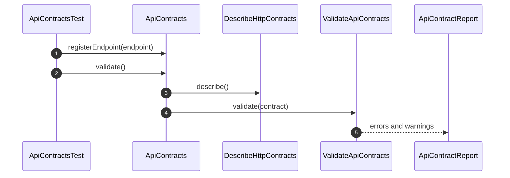

# API Contracts How This Works

## What this folder is

This folder documents the V2 API Contract Engine draft. The engine owns endpoint contract descriptions, validation of
contract completeness, and breaking-change detection between two contract snapshots.

## Real commands or triggers that reach this folder

- Targeted unit tests under `tests/Unit/Components/API/Contracts/`
- Future V2 contract validation commands after V1 Kernel Green is fully proven

## Exact upstream handoffs

- `components/API/Contracts/System/PublicSurface/ApiContracts.php`
- function: `ApiContracts::registerEndpoint(...)`
- function: `ApiContracts::validate()`
- function: `ApiContracts::detectBreakingChanges(...)`

## The simplest story

- A caller registers endpoint contracts through `ApiContracts`.
- `DescribeHttpContracts` reads the local adapter and returns an `ApiContract` snapshot.
- `ValidateApiContracts` checks required endpoint guarantees.
- `DetectBreakingApiChanges` compares an old snapshot with a new snapshot.

## The first important path

When a test creates an in-memory contract registry, the important path is:

- **Step 1:** `ApiContracts` receives the public call and stores the endpoint through an adapter.
- **Step 2:** `DescribeHttpContracts` creates a stable contract snapshot.
- **Step 3:** `ValidateApiContracts` evaluates the snapshot.
- **Step 4:** `ApiContractReport` carries the validation result.

## Refusal and failure behavior

An endpoint without a success response is invalid. Removed endpoints are treated as critical breaking changes.

## Where to debug first

Start with `ApiContracts::validate()` for validation issues and `DetectBreakingApiChanges::detect()` for compatibility
issues.
