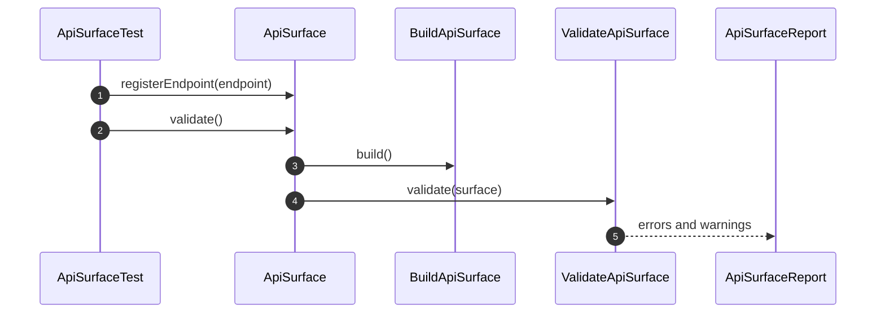

# API Surface How This Works

## What This Folder Is

This folder documents the V2 API Surface component. The component owns endpoint definitions, request payload schemas,
response payload schemas, authentication requirements, compatibility analysis, and API documentation source material.

## Real Commands Or Triggers

- Targeted unit tests under `tests/Unit/Components/API/Surface/`
- Future V2 API compatibility validation commands

## Exact Upstream Handoffs

- `components/API/Surface/System/PublicSurface/ApiSurface.php`
- function: `ApiSurface::registerEndpoint(...)`
- function: `ApiSurface::validate()`
- function: `ApiSurface::detectCompatibility(...)`

## The Simplest Story

- A caller registers endpoint definitions through `ApiSurface`.
- `BuildApiSurface` reads the documentation source and returns an `ApiSurfaceDefinition` snapshot.
- `ValidateApiSurface` checks required endpoint guarantees.
- `DetectApiCompatibilityChanges` compares an old surface with a new surface.

## The First Important Path

## Failure Behavior

An endpoint without a success response is invalid. Removed endpoints are compatibility issues and are classified as
critical by `CompatibilityReport::criticalChanges()`.

## Where To Debug First

Start with `ApiSurface::validate()` for endpoint shape issues and `DetectApiCompatibilityChanges::detect()` for
compatibility output.
