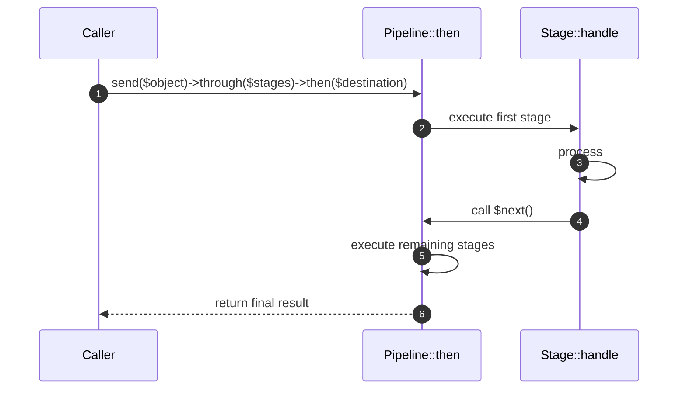

# Application Pipeline How This Works

## What this folder is

The `Application/Pipeline` component provides a generic implementation of the "Pipeline" or "Middleware" pattern. it
allows passing an object through a series of stages (closures or classes) where each stage can perform operations and
decide whether to pass the object to the next stage.

## Real commands or triggers that reach this folder

- HTTP Middleware execution.
- Any internal flow that uses `Avax\Components\Application\Pipeline\System\PublicSurface\Pipeline`.

## The simplest story

- A `Pipeline` is created with a series of "stages".
- An "input" object is passed to `send()`.
- The pipeline executes each stage in order.
- Each stage receives the object and a `next` closure.
- The pipeline returns the final result after all stages have executed.

## The first important path

## Child folders in this folder

### System/

Open `System/how-this-works.md`.

## What to remember

- Stages can be `Closure`s or classes with a `handle()` method.
- The pipeline is immutable; `send()`, `through()`, and `via()` return new instances or the final result.
