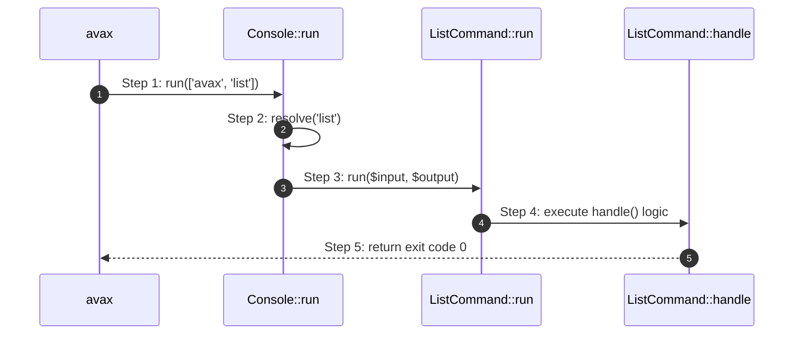

# CLI Console How This Works

## What this folder is

The `CLI/Console` component owns the framework's command-line interface infrastructure. It provides the registry for
commands, handles input parsing from `argv`, and manages output writing to the terminal with support for colors and
formatting.

## Real commands or triggers that reach this folder

- `php avax <command>`
- `php tooling/pre-commit/run-pre-commit.php`
- Any CLI entry point that uses `Avax\Components\CLI\Console\System\PublicSurface\Console`.

## Exact upstream handoffs

- `avax` binary
- function: `main` (implicit in PHP binary execution)
- `avax` -> `Console::run`([])

## The simplest story

- A user types a command in the terminal.
- The `avax` binary bootstraps the application and hands the `argv` array to `Console::run()`.
- `Console` resolves the command name to a registered `Command` instance.
- `Console` parses the remaining arguments into a `ConsoleInput` and executes the command's `run()` method.
- The command executes its `handle()` logic and returns an exit code.

## The first important path

When you type:

```bash
php avax list
```

the important path is:



- **Step 1:** The `avax` binary extracts the command name and passes the remaining `argv` to the `Console`.
- **Step 2:** `Console` looks up the 'list' command in its internal registry.
- **Step 3:** `Console` creates a `ConsoleInput` and calls the `run()` method of the resolved command.
- **Step 4:** The command parses its signature, binds arguments, and executes its business logic.
- **Step 5:** The exit code (usually 0 for success) is propagated back to the OS.

## Direct files in this folder

Open `System/how-this-works.md` for details on internal structure.

## Child folders in this folder

### System/

Open `System/how-this-works.md`.

## Debug first

- Start in `Console::run()` when a command is not found or fails to start.
- Start in `Command::run()` when arguments are not binding correctly.
- Check `ConsoleInput::parse()` for raw `argv` parsing issues.

## What to remember

- Every command must extend the `Command` base class.
- Positional arguments are bound by name according to the `{signature}`.
- Exit codes `0`, `1`, and `2` have standard meanings (SUCCESS, FAILURE, INVALID).

## Dictionary

- `Command`: A class representing a single CLI action.
- `Signature`: A string definition of a command's name, arguments, and options.
- `ConsoleInput`: A value object holding parsed arguments and options.
- `ConsoleOutput`: A service for writing formatted text to the terminal.
