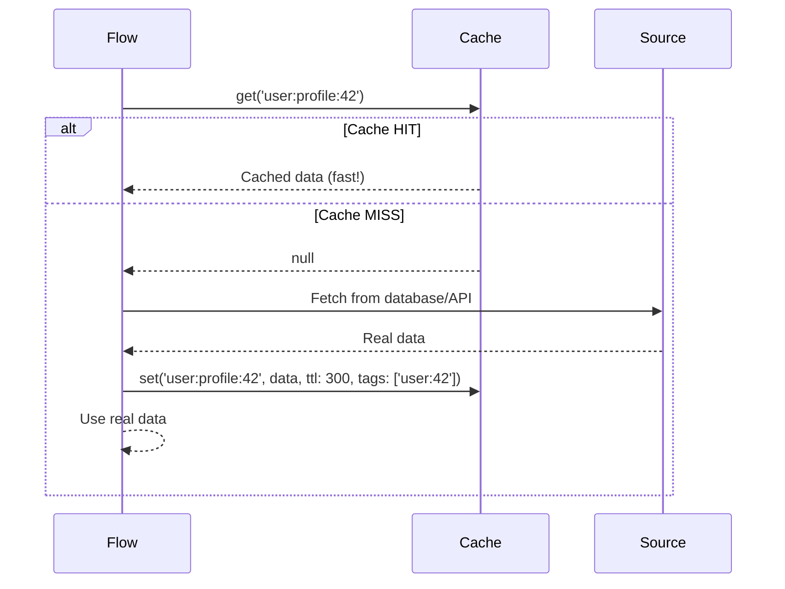
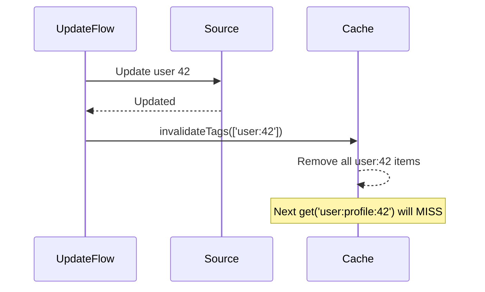

# Cache Read-Through Pattern

## What This Diagram Shows

The read-through pattern is the most common cache usage pattern:
1. The Flow asks Cache for data
2. If Cache has it (HIT), the Flow uses it immediately — very fast
3. If Cache doesn't have it (MISS), the Flow fetches from the real source
4. The Flow stores the fetched data in Cache for next time
5. The Flow uses the data regardless of whether it came from cache or source

## When Data Changes

When data changes, tag invalidation removes all stale cache items. The next read will MISS and fetch fresh data from the source.
