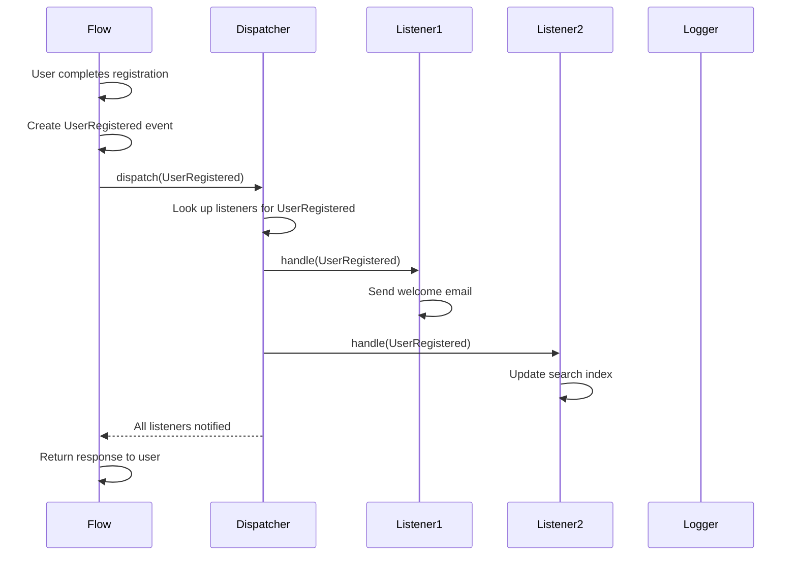
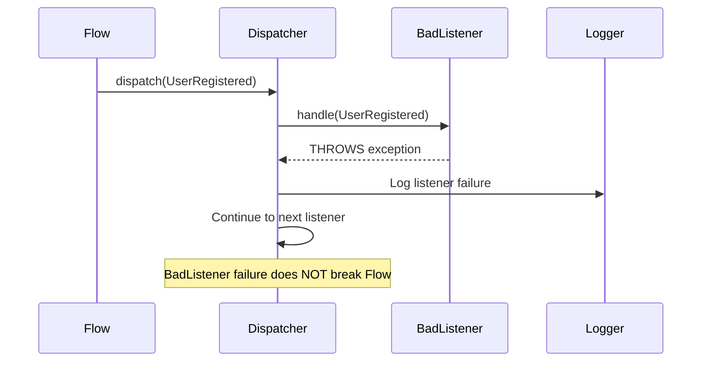

# Event Dispatch Lifecycle

## Key Phases

1. **Event Creation**: Flow creates an event object with relevant data
2. **Dispatch**: Flow hands the event to the Dispatcher
3. **Fan-Out**: Dispatcher finds all registered listeners for this event type
4. **Execution**: Each listener runs (synchronously or queued)
5. **Completion**: Dispatcher returns control to the Flow

## Failure Handling

When a listener fails, the Dispatcher:
1. Logs the failure (with event type, listener class, exception)
2. Continues to the next listener (one bad listener doesn't break others)
3. Does NOT throw back to the Flow (the Flow's job is done)
4. Optionally retries failed listeners (configurable per listener)
