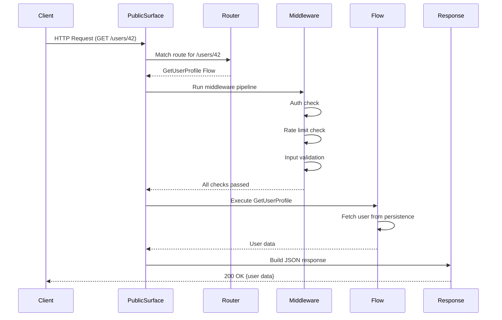

# HTTP Request Lifecycle

## Key Phases

1. **Receive**: PublicSurface catches the raw HTTP request
2. **Route**: Router matches URL to a Flow
3. **Guard**: Middleware checks authentication, authorization, rate limits
4. **Execute**: Flow runs the business behavior
5. **Respond**: Response builder formats the result
6. **Return**: Client receives the response

## Failure Points

- **Route not found**: 404 response
- **Middleware rejects**: 401/403/429 response (depending on which middleware rejected)
- **Flow throws exception**: 500 response (internal details never exposed)
- **Response build fails**: 500 response
