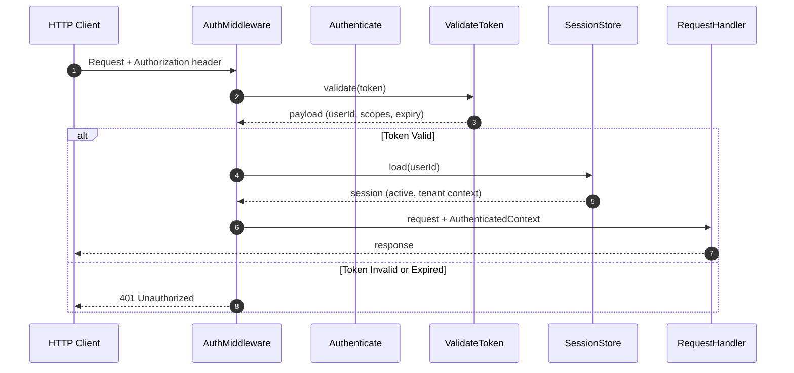

# Authentication Flow

> Shows how an API request is authenticated from HTTP request to verified identity context.

## Diagram

## Step-by-Step

1. **Client sends request:** HTTP request arrives with Authorization header containing a Bearer token
2. **Middleware intercepts:** AuthMiddleware captures the token before the request reaches handlers
3. **Token validated:** ValidateToken capability verifies signature, expiry, issuer, and claims
4. **Session loaded:** SessionStore loads the user's session to verify it is active and get tenant context
5. **Context attached:** AuthenticatedContext (userId, roles, tenant) is attached to the request
6. **Handler processes:** Handler receives the authenticated request and processes it
7. **Invalid token:** If token is invalid or expired, 401 is returned immediately — no handler access

## Participants

| Participant | Role | Key Files |
|-------------|------|-----------|
| AuthMiddleware | HTTP interception, token extraction | `HTTP/Middleware/AuthMiddleware.php` |
| Authenticate | Authentication entry point | `Identity/Capabilities/Authenticate/Authenticate.php` |
| ValidateToken | Token signature and expiry checks | `Identity/Capabilities/ValidateToken/ValidateToken.php` |
| SessionStore | Session persistence and retrieval | `Identity/Capabilities/SessionStore/SessionStore.php` |

## Failure Modes

| Step | Failure | Behavior |
|------|---------|----------|
| 3 | Token expired | 401, no handler access |
| 3 | Invalid signature | 401, no handler access |
| 3 | Malformed token | 401, no handler access |
| 4 | Session expired or revoked | 401, session must be re-established |
| 4 | Session not found | 401, user must log in again |

## Related

- ADR 0001: Token Lifecycle Separation
- ADR 0002: Session vs Authentication Separation
- Dictionary: Authentication, Token, Session
