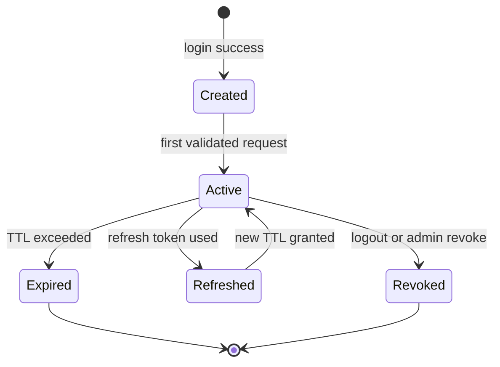

# Session Lifecycle

> Shows the state transitions of a user session from creation to termination.

## Diagram

## States

| State | Meaning |
|-------|---------|
| Created | Session record created after successful authentication |
| Active | Session is valid and being used |
| Expired | Session TTL exceeded, session is dead |
| Refreshed | Session was refreshed (new TTL), transitioning back to Active |
| Revoked | Session explicitly terminated (logout, admin revoke) |

## Transitions

| From | To | Trigger |
|------|----|---------|
| [*] | Created | Successful login |
| Created | Active | First request with session validation |
| Active | Expired | TTL exceeded (timeout) |
| Active | Refreshed | Valid refresh token used |
| Active | Revoked | Logout or admin termination |
| Refreshed | Active | New TTL confirmed |
| Expired | [*] | Session cleaned up |
| Revoked | [*] | Session cleaned up |

## Related

- ADR 0002: Session vs Authentication Separation
- Dictionary: Session
