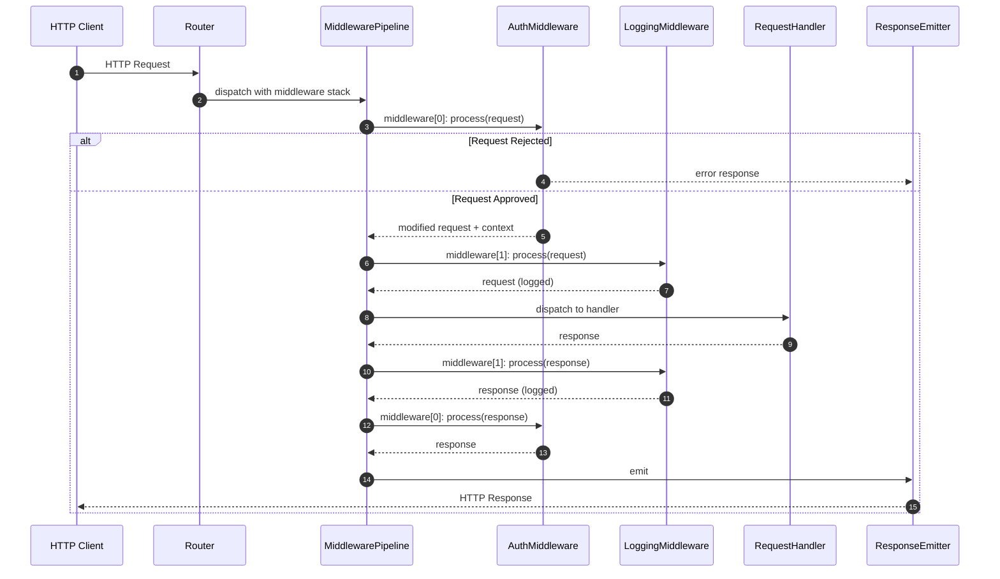

# Request Pipeline

> Shows how an HTTP request flows through the middleware pipeline to the handler and back.

## Diagram

## Step-by-Step

1. **Request arrives:** Router receives HTTP request and identifies matching route and middleware stack
2. **Pipeline starts:** Pipeline iterates through middleware in registration order
3. **Auth middleware:** AuthMiddleware extracts token, validates it, attaches identity context. Can reject with 401
4. **Logging middleware:** LoggingMiddleware logs the incoming request
5. **Handler processes:** Handler executes domain logic and returns response
6. **Response travels back:** Response passes through middleware in reverse order (logging then auth)
7. **Response emitted:** ResponseEmitter sends the HTTP response to client

## Participants

| Participant | Role |
|-------------|------|
| Router | Route matching, middleware stack selection |
| MiddlewarePipeline | Ordered middleware execution |
| AuthMiddleware | Authentication check |
| LoggingMiddleware | Request/response logging |
| RequestHandler | Domain logic execution |
| ResponseEmitter | HTTP response emission |

## Related

- Dictionary: Middleware Pipeline
- ADR: 0001 - Pipeline ordering policy
