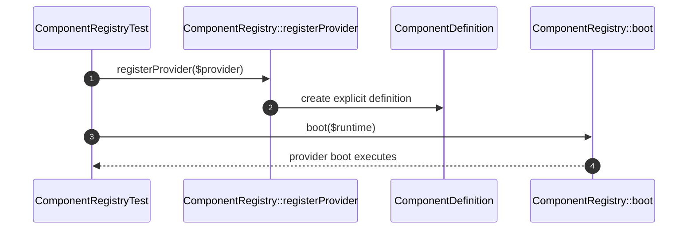

# Component Registry How This Works

## What this folder is

This folder owns the explicit catalog of framework-known component providers.

## Real commands or triggers that reach this folder

- `BuildApplication::fromProjectPath(...)->registerComponentProvider(...)`
- `Avax::boot(...)`

## Exact upstream handoffs

- `Configuration/BuildApplication/ApplicationBuilder.php`
- function: `ApplicationBuilder::registerComponentProvider(...)`
- `BuildApplicationState.php` -> `ComponentRegistry::registerProvider(...)`

## The simplest story

- configuration registers component providers.
- boot turns providers into explicit component definitions.
- runtime can boot those providers without guessing ownership.

## The first important path

When you type:

```bash
vendor/bin/phpunit tests/Unit/Framework/System/Capabilities/ComponentRegistry/ComponentRegistryTest.php
```

the important path is:



- **Step 1:** a provider is registered explicitly.
- **Step 2:** the registry captures a stable definition.
- **Step 3:** boot can invoke providers against the assembled runtime.
- **Step 4:** duplicate names fail early.

## Direct files in this folder

### ComponentRegistry.php

This is the file where component ownership becomes explicit.

When the story opens this file:

- `BootApplication::boot(...)` -> `BuildApplicationState::build(...)` -> `ComponentRegistry.php`

What arrives here:

- provider instances
- the need for one owner per component name

What leaves this file:

- explicit definitions
- bootable providers

Why you open it first:

- the same component name appears twice
- a provider was configured but never booted

## Child folders in this folder

### none

Open the direct files in this folder.

Use it when:

- provider registration changes
- component ownership is unclear

## Debug first

- start in `ComponentRegistry::registerProvider(...)` when duplicates appear
- start in `BuildApplicationState::build(...)` when providers are missing from runtime

## What to remember

- component ownership is explicit.
- duplicate component names are configuration failures.
- the registry is a framework-level catalog, not a runtime adapter.

## Dictionary

<a id="dictionary-component-provider"></a>

- `component provider`: a unit that bootstraps one reusable component into the framework runtime
